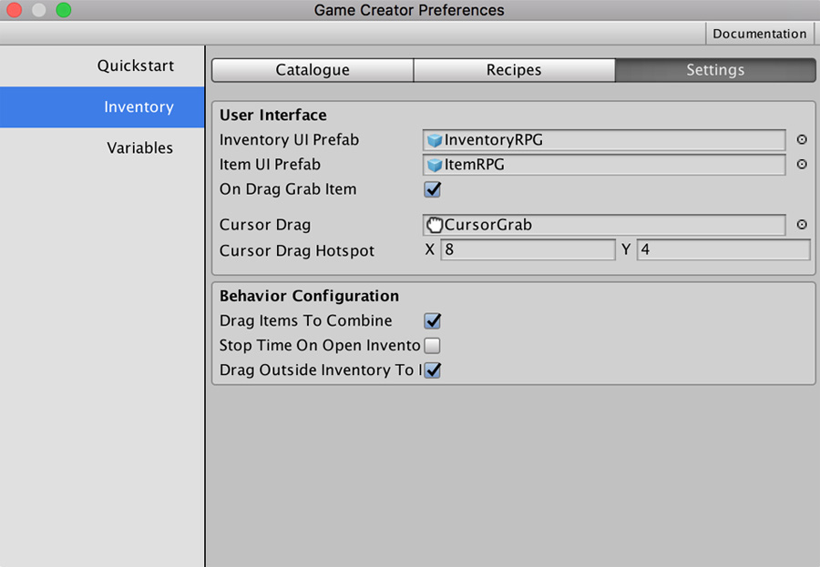
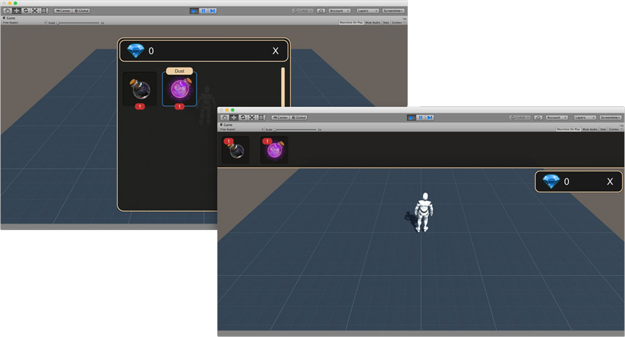

# Settings

In the _Settings_ tab you can configure all the necessary information related to the **Inventory** module. It's divided into different sub-sections such as _User Interface_ and _Behavior Configuration_.


The **`Item UI Prefab`** field is no longer there and has been moved as part of the Inventory UI component inside the prefab used as **`Inventory UI Prefab`** field.


## User Interface 

In this section you can define how the **Inventory** looks like in the game.

**Inventory UI Prefab** and **Item UI Prefab** fields tell **Game Creator** what should be instantiated when the game requests to open the inventory. There's a complete chapter dedicated to this topic, but as a teaser, **Game Creator** comes with a couple of **Inventory** interfaces that can be seen in the image below. You can switch between them by setting the _InventoryRPG_ or the _InventoryAdventure_ prefabs in the **Inventory UI Prefab** field.


See [Custom User Interface](../custom-inventory-ui.md) section for more information


The **On Drag Grab Item** toggle allows to enable/disable showing the **Item** picked below the cursor. This is only useful if you intend to disable all **Items** combinations. Otherwise, we recommend leaving it enabled.

**Cursor Drag** and **Cursor Drag Hotspot** are, as their name implies, the cursor used when dragging an item around.

## Behavior Configuration 

In the _Behavior Configuration_ section you'll see options to set or unset **Inventory** features.

**Drag Items To Combine** option allows to enable or disable dragging and dropping an **Item** onto another to trigger a **Recipe** process. For example, if there's a **Recipe** with items _A_ and _B_ and the user drags _A_ onto _B_ \(or the other way around\), then they both will be destroyed and the **Recipe** actions set will be executed. If **Drag Items to Combine** is set to false, they will never be combined by dragging one onto the other.

**Stop Time On Open Inventory** allows to pause the game \(the `TimeScale` is set to `0`\) when opening the inventory, and resume when closed.

**Drag Outside Inventory to Instantiate** allows to drag items outside the **Inventory UI** window and instantiates the associated prefab in the scene. This feature is very useful. You can, for example, drop items from the **Inventory** and pick them up again from the scene, or you can use it to place mines in the scene for them to explode when a _Character_ is nearby. Again, we provide the tools, you the creativity!

