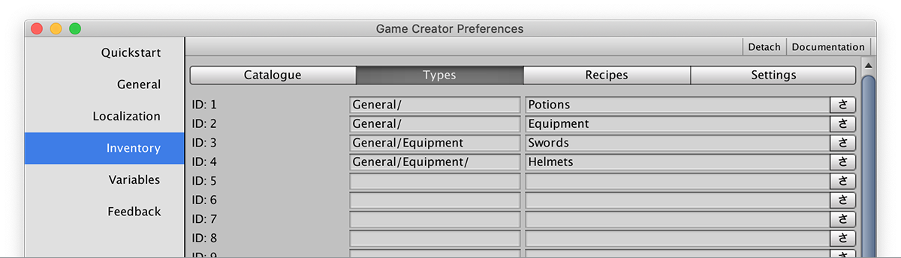

# Types

Any item can belong to zero, one or more categories. These categories \(or item types\) are defined in the **Types** tab.


**Item Types** were introduced in version 0.5.2


An Item **Type** is identified by the concatenation of the **ID** and the **Name**. These should be unique across all other Types and can contain a "/" character to indicate being a sub-element of another item. In the example above, _Swords_ and _Helmets_ are sub elements of _Equipment_.


Though not required, it's a good practice to keep all sub elements with a "/" separator. This will allow finding sub items much faster, since they will be placed as a sub category when selecting a type in a dropdown menu.



You can create up to **32** different item **Types**.


Item **Types** can be used for a wide variety of reasons. One of them is using a **Type** to define which items are equipable and where can they be equipped. 


For example, you could assign the Type "_Right Hand_" to a _Sword_ and use all items that contain the type "_Right Hand_" as equipables to that slot.


Another use for **Types** is to organize the Player's inventory UI. You can choose to show specific items that belong to a category or multiple categories.


For example, you can define a "Consumable" type and assign it to Potions and Food so they are displayed in a consumable menu.


