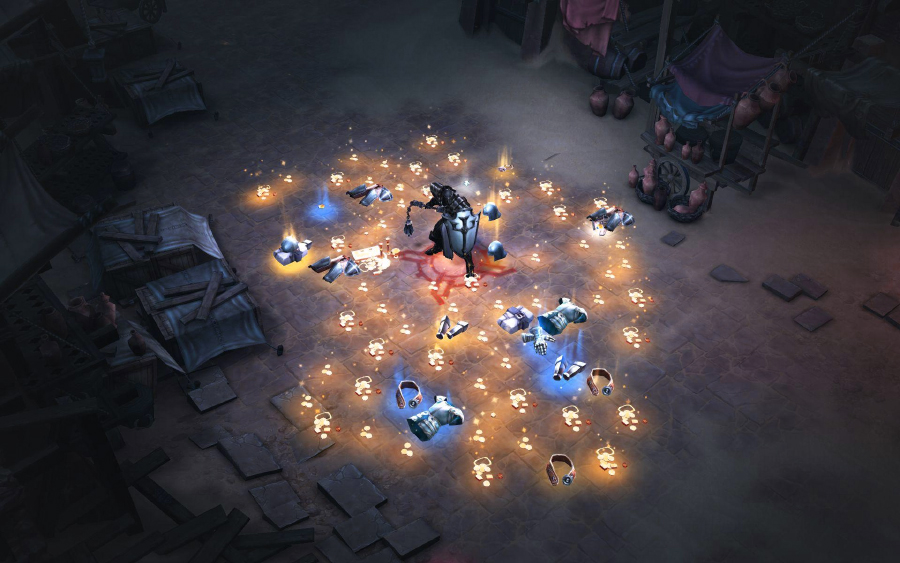
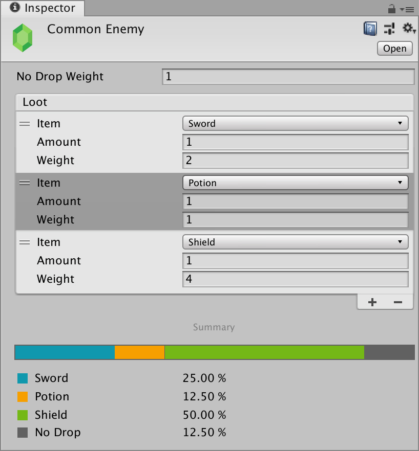
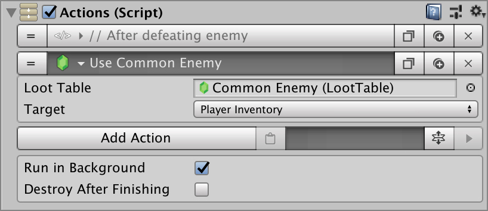

# Loot Tables

**Looting** is an integral part of any RPG game and is one of those things game designers never stop tweaking during the development of the game, because its relies on player progression and a misplaced item could make the Player overpowered at the beginning of them game.

That's why we wanted to create a looting system that was easy to debug and tweak.

**Loot Tables** allow to easily define what items will be dropped after doing a certain task and with which probability these items will be dropped \(if any at all\).

To create a **Loot** **Table** object, right click on the **Project Panel** and select **`Create → Game Creator → Inventory → Loot Table`**. This will create a **Loot Table** object you can place anywhere you want in your project.


We recommend keeping all **Loot Table** objects inside a **`Assets/LootTables/`** folder in your project, but feel free to organize them as you see fit.


A **Loot Table** is based on [weighted probabilities.](https://en.wikipedia.org/wiki/Weight_function) At the end of the **Loot Table** there's a **summary** of the probabilities of dropping each item based on their weight.

For example, if two items have the following probability weights:

* **Item A:** 3
* **Item B:** 1

The probability of dropping **Item A** is 75% while dropping **Item B** is only 25%

## Using Loot Tables in a game

Once you have created a **Loot Table**, using it is very simple. All that needs to be done is call the **Use Loot Table Action** and drag and drop the **Loot Table** object onto its field.

This will execute the **Loot Table** and give the **Player** a random item picked from the **Table** \(if any\). You can also send the randomly picked item into a **Container**, instead of the **Player** **Inventory**.


Executing a **Loot Table** will only pick one item. You might want to run it three, four or more times after defeating an  enemy to give the player not only one but multiple random items.

Each time  you execute a **Loot Table** you'll pick a different random item, even from them same **Actions** object.


