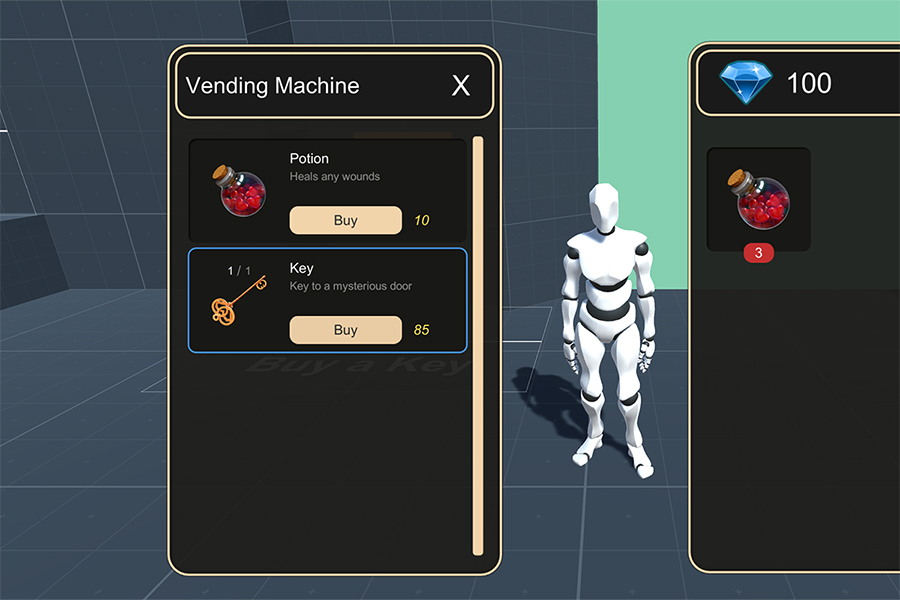

# Merchants

The **Inventory** module comes with a powerful **Merchant** system that allows to quickly define which items should a vendor sell and how many of them.

## The Merchant asset

First of all you need to create a **Merchant** object. To do so right click on the _Project panel_ and select `Create - Game Creator - Inventory - Merchant`.


Once you have created your **Merchant** definition object, all you need to do is to fill the **Title** and **Description** fields. These will appear at the top bar of the Merchant UI skin.

### Wares

Adding wares is as easy as clicking on the little **+** button and select which items you want. You can limit the amount of items the **Merchant** will sell to the Player.


If the Merchant has 50 Potions to sell and **Player** purchases 20 of them and then sells back 10 potions, the Merchant will still only be able to sell 30 potions.

Selling items to the **Merchant** doesn't add them to their wares and are considered destroyed.


### Discounts

Each **Merchant** can apply a percentage-based discount for purchasing and selling items from the **Player**. 

By default, the purchase value \(an item goes from the **Player** to **Merchant**\) is set to 0.75 of its value. It makes sense to have a lower value since the item was in possession of the player and is considered as a second-hand item.

On the other hand, the sell value of an item \(an item goes from the **Merchant** to the **Player** Inventory\) has a default value of 1. This means that the **Merchant** will sell its items at their full price, which is specified by item in the **Catalogue**.


You can create a **dynamic discount system** by binding the discount to a **Variable**. This way, the **Player** could take **Quests** from the **Merchant**, who in returns applies better discounts on their products based on how well the **Player** solved the tasks or its reputation.


The price of the product is calculated as follows:

```text
Purchase Price = Item Price * Purchase Discount
```

```text
Sell Price = Item Price * Sell Discount
```

For example, a _Steel Sword_ that has a base price of 100 coins and a **Merchant** that has a discount of 0.8 for selling and 0.5 for purchasing will result in:

* **Player Purchases Steel Sword:** 100 \* 0.8 = **80 coins**
* **Player sells a Steel Sword:** 100 \* 0.5 = **50 coins**

## Merchant Window

To open a **Merchant window** inside your game all you need to do is to call the **Merchant UI** action and drop in the **Merchant** object.




You can customize the Merchant window the same way as the Inventory window. For more information, see [Custom Inventory UI](custom-inventory-ui.md).


