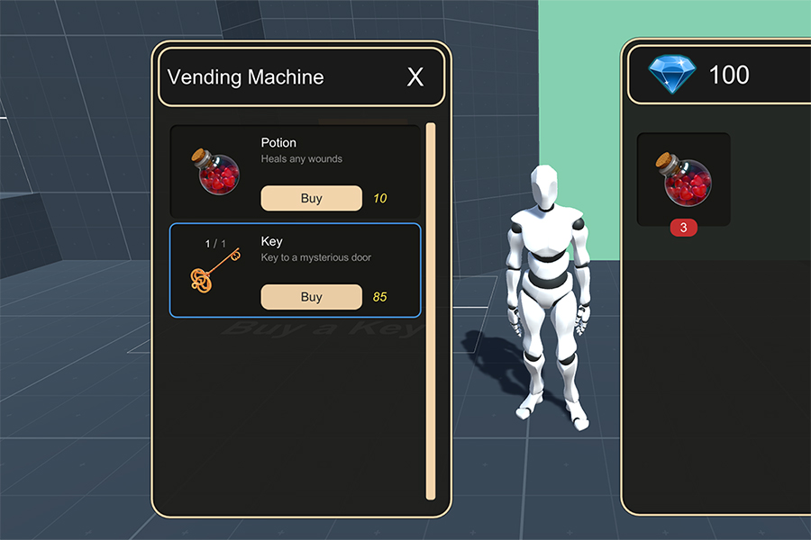

# Merchants

The **Inventory** module comes with a powerful **Merchant** system that allows to quickly define which items should a vendor sell and how many of them.

First of all you need to create a **Merchant** object. To do so right click on the _Project panel_ and select `Create - Game Creator - Inventory - Merchant`.

Once you have created your **Merchant** definition object, all you need to do is to fill the **Title** and **Description** fields and populate the **Wares**.

Adding wares is as easy as clicking on the little **+** button and select which items you want.

## Merchant Window

To open a **Merchant window** inside your game all you need to do is to call the **Merchant UI** action and drop in the **Merchant** object.


You can customize the Merchant window the same way as the Inventory window. For more information, see [Custom Inventory UI](custom-inventory-ui.md).


