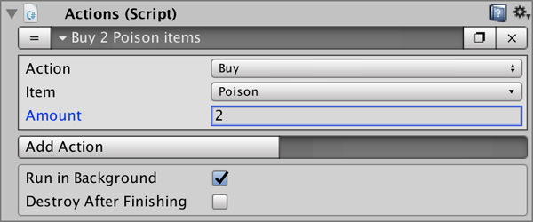

# Actions

The **Inventory** module includes a set of **Actions** that complement **Game Creator**'s and allow to _do_ things with **Items**, **Recipes** and the player's **Currency**.


The **Player** **Inventory** is where all the items being carried are stored. this inventory is automatically saved when calling the **Save** Action so you don't need to worry about losing data between play sessions.


## Action Currency

Allows to _Add_ or _Subtract_ currency from the Player's Inventory.

## Action Instantiate

Instantiates \(adds to the scene\) a copy of the _Prefab_ associated to the **Item**.


For example, you can instantiate a 3D model of a potion that adds 1 Potion item to the players to simulate dropping and picking it again.


## Action Item

Allows to manipulate an **Item**. You can either _Add_ the item to the Player's Inventory, _Substract_ a certain amount of _Consume_ the ones it has.

## Action Inventory UI

Opens or closes the Player's Inventory UI.

## Action Use Recipe

Tries to find a **Recipe** with the two select **Items**. If it successfully finds one, it combines those objects executing the previously defined **Actions** associated to the **Recipe**.

## Action Shop

Allows to _Buy_ or _Sell_ an **Item** \(and a defined amount of these\). The difference between _Buying_ and _Adding_ is that an **Item** has a price. If the player doesn't have enough **Currency** to purchase the **Item/s**, then it won't do anything. The same applies to _Selling_. If the player is not carrying enough **Items** in his inventory, the transaction won't be fulfilled.

