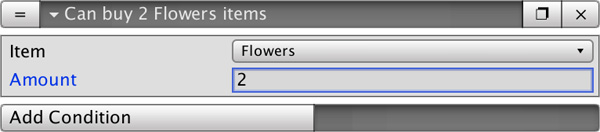
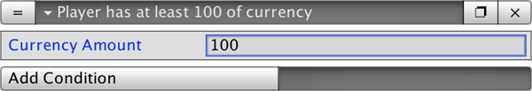
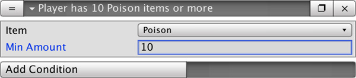
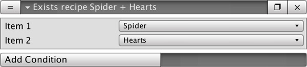

# Conditions

The **Inventory** module includes a set of **Conditions** that complement **Game Creator**'s and allow to _check_ whether an **Item** can be bought, if the player has a certain amount of items, etc...

## Condition Can Buy

Checks whether an **Item** or an amount of **Items** can be bought with the current amount of currency.

## Condition Enough Currency

Checks whether the player has at least the amount specified of currency.

## Condition Enough Items

Checks whether the player is carrying at least the amount of specified of items.

## Condition Recipe Exists

Checks whether a combination of two **Items** will result into something. If no **Recipe** is found to contain these two **Items** then it returns false.

