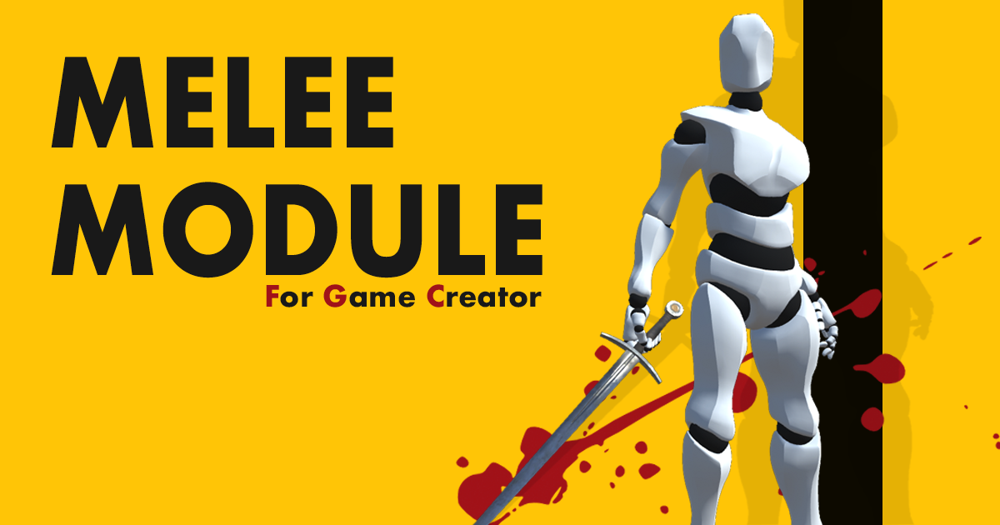

# Melee

The **Melee** module is a **Game Creator** extension that allows to easily create close quarter combat with different white weapons, such as \(but not limited to\), swords, hammers, axes, daggers, fists, etc.


Download the [**Melee**](https://gamecreator.page.link/melee) module


If you prefer to learn by watching a video, you can do so by heading onto the official live-stream presentation:



## Overview

The **Melee** module defines three different game assets that, used together, will let you build the combat system of your choosing:

* **Weapon Asset:** This asset defines the properties of the weapons, as well as how the character reacts to hits from other combatants. It also comes with a visual _combo creator_ system.
* **Shield Asset:** This asset, which is imbued into a Weapon Asset, defines how the weapon wielder will block \(or not\) incoming attacks.
* **Melee Clip:** These assets allow to define how a particular animation will be played, giving information about whether it's an attack, what kind of movement does this animation do as well as modify the state of the combatant character.

This is but a very simplistic definition of the three main assets that come with the **Melee** module. You can see a fully detailed guide on each one of them in subsequent pages.

The idea is that a character, at any given moment, can be wielding a **Sword** asset. This sword asset may or may not have a **Shield** asset. if the character doesn't have a Shield asset, it won't be able to block incoming attacks and will always receive the full damage.

A combat is made of little animations that modify the state of the fight. For example, when the Player makes a sword slash, the system will play an animation showing this slash. It will also try to detect any enemies along the slash path and perform different operations, such as subtracting health on the enemy and apply particle and sound effects. These animations, plus all the side-effects these create, are defined using **Melee Clip** assets.

However, an attack also modifies the state of the character attacking. For example, following the previous example, a slash also tells the fighting system that the player is currently performing an attack and won't be responding to commands such as evading or attacking again, until the attack is complete.

## Extra Features

This module comes with a collection of features and mechanics that, transparently to the game designer, allow to create a smooth combat system. We've dedicated a lot of hours in order to emulate a AAA production game experience while keeping the entire module as simple and straightforward to use as possible.

### Input Buffer

All key strokes and button presses are enqueued and kept during a relatively short time. This allows to create smooth combo chains that are not dependent on how fast the player presses the button, improving the overall experience without any need to configure anything.

For example, when executing a combo chain, the second attack will be enqueued to be executed if the player presses the attack a few milliseconds before the first attack is performed.

### Smooth Transitions

_The devil's in the details_. Have you ever played a game where, during combat, the character plays an attack animation, returns to an idle pose, only to perform a second attack? This is due to there's no recovery animation between the end of the first attack and the second one.

Based on the [Disney's 12 principles of animation](https://en.wikipedia.org/wiki/Twelve_basic_principles_of_animation#Anticipation), the Melee Clip asset allows to define 3 attack phases inside a single attack animation:

* **Anticipation:** Where the character starts winding up the attack.
* **Activation:** When the attack is performed.
* **Recovery:** The follow-through of the momentum of the attack.

When executing a second attack in a combo chain, the recovery phase is replaced by the beginning of the new attack, allowing for a much smoother combat system.

If no combo attack is followed-up after executing an attack, the recovery animation will be played till the end.

On top of that, each **Melee Clip** allows to define a certain amount of blending between the previous animation pose and the following. This lets you seamlessly chain multiple animations, improving even further the sensation of a fluid combat.

### Catmull-Rom Spline Weapon Trails

Fancy name, huh? Have you every tried attacking a TrailRenderer component onto a game object and move it really fast? If the answer is yes, you'll have probably noticed a very jarring effect where the trail isn't smooth. That's because each vertex of the trail depends on the frame-rate of your computer.

To solve this and create smooth weapon trails, we've implemented a custom [Catmull-Rom spline](https://es.wikipedia.org/wiki/Spline_de_Catmull-Rom) algorithm that extrapolates a certain amount of vertices based on the movement of the sword. This allows to have much smoother trails that give the impression of finesse and combat skill.

### Fair Fight

This is possibly the most subjective hidden feature that we've implemented based on our experience when making games. When naively creating a combat system it's easy to fall into a stalled system where one character stun-locks another one, making the fight unfair and boring.


**Stun-Lock** is a term used to represent when the chain of attacks from one character prevent the opponent from counter attacking. This causes frustration, since the player or enemy can't do anything to retaliate and the result of the fight is decided before it ends.

A good combat system must always allow to come back and turn the tables.


Inspired by _From Software_'s _Souls_-like and _Sekiro_ games, we've created a **Poise** meter that makes it easier to disengage stun-locks.


**Poise** is the ability of a character to withstand hits without being knocked back. 


The main idea is that, apart from the typical health bar, a character also has a Poise meter, which gradually increases over time until it hits its maximum capacity.

After each successful attack received, this poise meter decreases. When it reaches a value of zero, the player is knocked-back.

When a character is knocked-back, it creates a bigger gap between the enemy/ies and the player, breaking the pace of the combat and allowing to both sides to recover and start the fight again.

More information and tips on combat systems can be read in the [Combat](combat.md) chapter.

