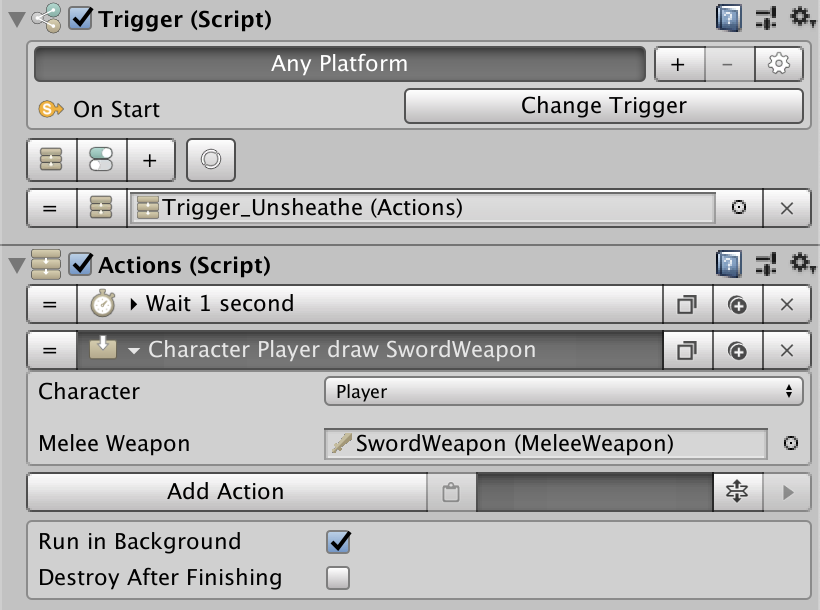
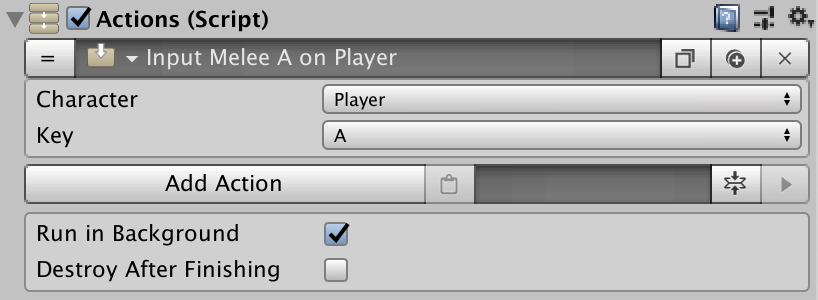
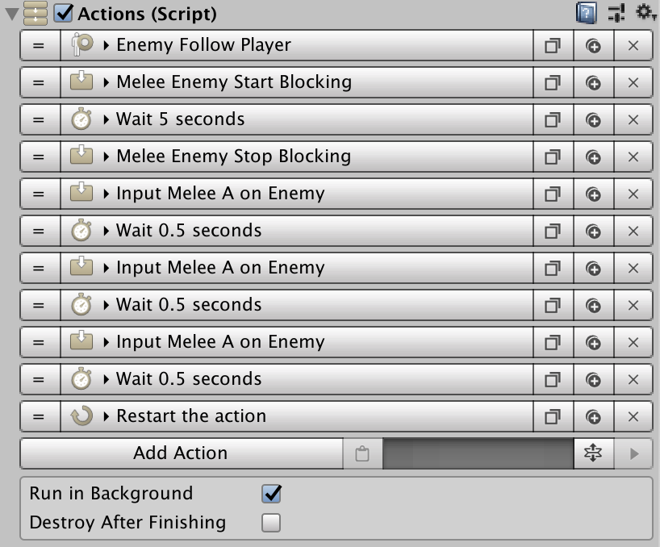

# Combat

Time to put everything learned together. So, we have Weapon assets which determine how the weapon captures hits and has a list of combo attacks, represented using Melee Clips. We also have a Shield asset associated that determines how the weapon will block and react to hits while blocking.


The **Melee** module comes with an example scene with all the building blocks already laid out for you. We'll use this example scene to explain step by step how to build a similar scene so you can adapt it to your game.

A WebGL demo can be played here: [demos.gamecreator.one/demo/melee](https://demos.gamecreator.one/demo/melee).


So, the question is: How do we create a combat system?

## Engaging Combat

We'll start seeing how to start engaging foes. Both from the Player and enemy perspectives, the process is the same. A Character must be wielding a weapon in order to be hurt.

So the first thing to do is to draw a weapon from the sheathe using the **Draw Weapon** action and passing the desired weapon as a parameter. 

Once the character has the weapon draw \(the same should be done with the other enemies\), it's time to lock onto their opponents.

Enemies should always lock onto the Player. however, depending on the type of game, you may want to let the player lock onto enemies or use a more free-flow approach so it can attack anyone around.

To lock a character onto another one, simply use the **Focus Target** Action. It will automatically face it and all attacks will be directed towards its opponent. This is the easiest way to let enemies approach the Player.

## Attacking

Attacking works the same way for the player and for enemies. In the **Combo Creator** list from the Weapon there should be a bunch of chains of attacks specified by key letters, like A+A+A. 

In order to execute attacks, all that needs to be done is to use the **Input Melee Attack** Action. This, rather than instantly executing the desired attack, it will enqueue the command.

_Input Commands_ are enqueued in a list and have a certain lifetime. If their lifetime expires, the command is removed. This system has two major advantages over conventional direction input modes:

* Spamming the attack command won't make the character attack faster, but will simply attack at its maximum pace. Perfect for enemy AI behaviors.
* Provides input buffering out of the box. Input buffer adds a certain tolerance threshold that makes the game appear to run smoother and doesn't require split-second precise reactions.

From the Player's perspective, it needs to call the **Input Melee Attack** from a "On Key Down" **Trigger**. From an enemy perspective, it gets a bit more complicated, since we have to take into account how often we want an enemy to attack.

## Simple AI

We're going to create a very dumb enemy that simply goes towards the player and tries to attack him. Non-stop.

To do so, we create a **Trigger** that, _On Start_, calls an **Actions** object:

This Action seems verbose but is, in fact, very simple to understand. The first Action tells the enemy to follow the player around. The following three tell the character to start blocking, wait for 5 seconds and stop blocking. This will allow the enemy to move closer to the player while blocking any incoming attacks.

The following actions simply spam the Attack command so that the enemy starts buffering attack commands and execute them as soon as he is ready.

The last Action restarts this action so it loops indefinitely.

As you can see this is a very simple enemy Ai, but works pretty well for any standard game mob. You can easily tweak any parameters to make it more aggressive or change its behavior based on different parameters.


It is also worth noting that this module works best paired with the [**Behavior**](https://gamecreator.page.link/behavior) module \(for enemy AI\) and the [**Stats**](https://gamecreator.page.link/stats) module \(for Health and Stamina attributes\).


