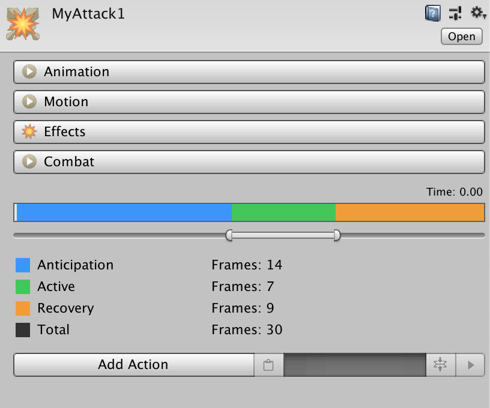
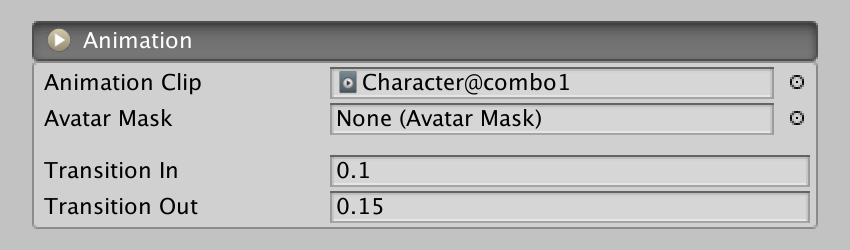
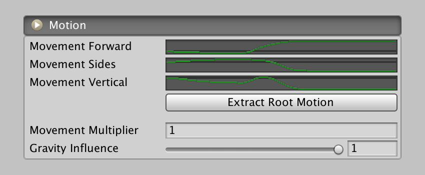
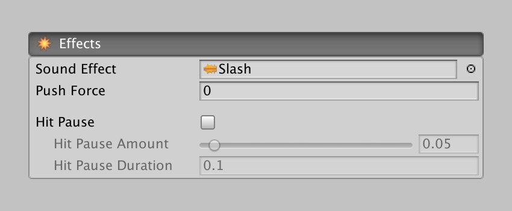
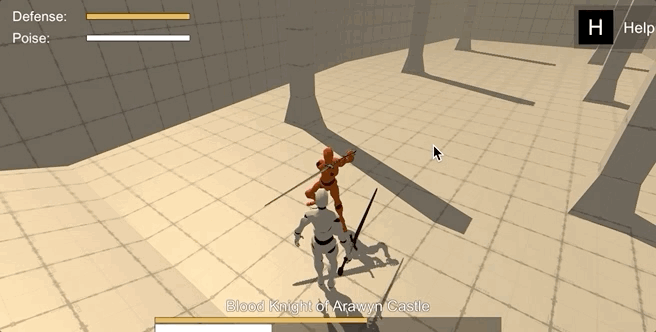
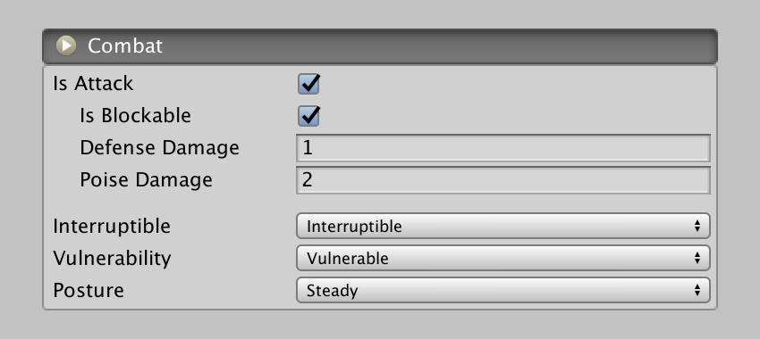
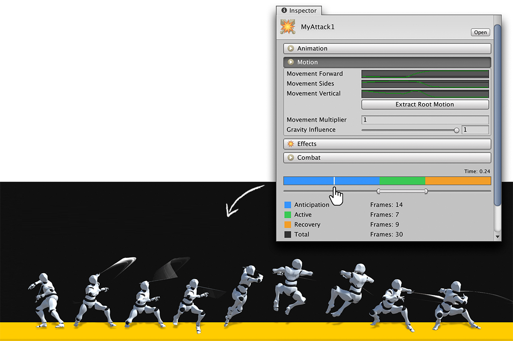

# Melee Clips

**Melee Clips** are the essential part of the **Melee** module. You can think them as animation clips in steroids, where you can not only define what animation will be played, but also what effects this animation has, when these happen and how this affects the character and enemies behavior.

There are 4 sections and a configuration timeline:

* **Animation:** Everything related to how this animation clip is played
* **Motion:** How the animation affects the character position
* **Effects:** What sound and particle effects will play
* **Combat:** How this clip affects combat

### Animation Section

This section defines what animation will be played, and whether it's going to use an avatar mask or not.

The **Transition In** and **Transition Out** fields define the amount of blending between the current character animation and the one defined in this Melee Clip. Unless you go for an ultra-stylized game, these values should have a magnitude of around 0.1 and 0.4 seconds.

### Motion Section

This section complements the previous one. It allows to define how the character moves during the playback of the animation by defining the delta increment of position.

Game Creator doesn't support root motion. However, if you use an animation using root motion, you can extract the delta motion and use it in the Melee Clip.

The **Movement Multiplier** field is a coefficient used to increase the scale of all motion proportionally.

**Gravity influence** defines how gravity will affect the character when playing this animation clip. A gravity influence of 1 will make the character react normally to gravity, while a value of 0 will make the character ignore the gravity.


A Gravity Influence value of zero is usually used when creating attacks that combine land and air attacks. For example, launching an enemy on the air and following it up.


### Effects Section

This section allows to define which sound effects will be played when the Melee Clip is used as well as how much _rigidbodies_ will be pushed \(in case the Melee Clip is an attack and collides with a rigidbody\).

The **Hit Pause** toggle allows to create hit pause effects \(also known ad freeze-frames\). These are cinematic effects that increase the bombastic feeling of the impact of an attack.

**Hit Pause Amount** is the time scale in which the game will be set and the **Hit Pause Amount** is the amount of real time seconds this effect will last for.

### Combat Section

This section is quite important and tweaking its parameters will completely change the experience of the game.

The **Is Attack** toggle defines whether this **Melee Clip** is considered an attack or not. This will enable or disable the timeline below and will hide and show options related to attacks.

**Is Blockable** defines whether this attack can be blocked by opponents. If an attack is not blockable, then it will bypass and hit any enemy, even if these are in a blocking stance.

**Defense Damage** and **Poise Damage** define how much this attack will chip from the hit opponent or opponents.


If the opponent is blocking, it will only subtract Defense damage. On the other hand, if the opponent wasn't blocking, it will decrease its poise by Poise damage amount.


**Interruptible** field tells whether if this **Melee Clip** can be interrupted when being played or not. By default it should always be set to _Interruptible_. However, in some situations, it may be interesting leaving it as _Uninterruptible_. For example, an enemy attack that takes a good chunk of time to load and creates a devastating area of effect damage should probably be set to uninterruptible. This will prevent the boss from cancelling the attack when receiving damage from the player.

**Vulnerability** field allows to define whether opponent attacks affect the character or not. By default it's set to Vulnerable. However, there may be cases where you want an animation clip to make the character completely invulnerable for a few seconds. For example, when dashing through the battlefield or changing phases if it's a boss battle.

**Posture** field can be set to either _**Steady**_ or _**Stagger**_. Steady posture means that the character can input commands and the character will respond normally. Stagger means that the input from the player/AI system will be ignored while this **Melee Clip** is being played. This is mostly used when a character receives damage, it plays a small animation clip reacting to the hit, in which the character is incapacitated for a few seconds.

### Attack Timeline

If marking the **Is Attack** toggle, a timeline with a legend will appear at the bottom of the **Melee Clip** asset.

This **Timeline** can be scrubbed with the cursor and the character selected in the scene view with play the animation.


If you can't scrub because it appears a message saying "Drop a scene Character onto the Preview Window", drag a Game Creator from the Hierarchy onto the small window below the Melee Asset, as seen in the GIF below.


Once you have this set up, you can start defining the animation attack phases. Any attack is divided into three phases: **Anticipation**, **Activation** and **Recovery**.

#### Anticipation

Also known as wind-up or start-up. In this phase, the character prepares to attack. As a general rule of thumb, the more powerful the attack, the greater this phase should be.

#### Activation

This is where the hit happens. Any enemy colliding with the Blade Component will be hit. Also, during this phase, the trail renderer \(if any\) in the Blade Component will be enabled and disabled at the end of the phase.


It is important to note that this phase should be at least two frames long in order to properly detect any objects passing through the weapon.


#### Recovery

This phase is where the character should try to stop the momentum from the attack. As a general rule, the more powerful the attack, the greater the momentum, and thus, the recovery phase should scale proportionally.


When concatenating two attacks in a combo \(let's say _AttackA_ and _AttackB_\), the recovery phase of _AttackA_ will be skipped and _AttackB_ will start as soon as the activation phase of _AttackA_ finishes. 

This is intentional. Combos are meant to be combination of attacks that take advantage of the momentum of the previous attack to start the new one.


