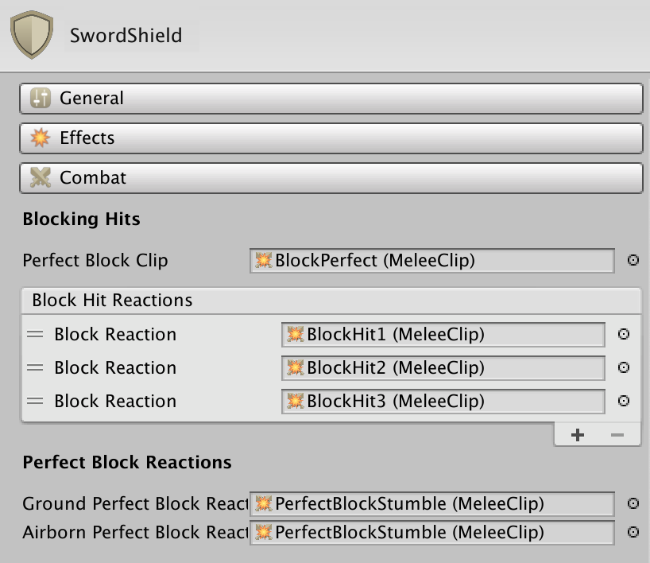
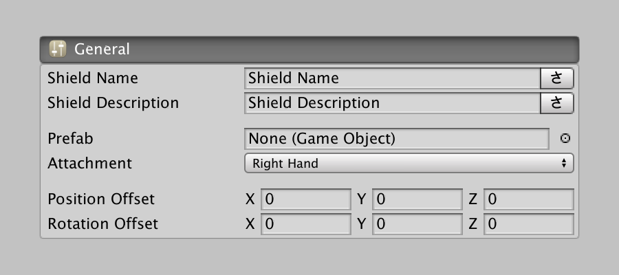
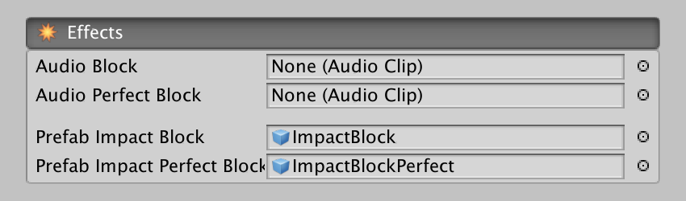
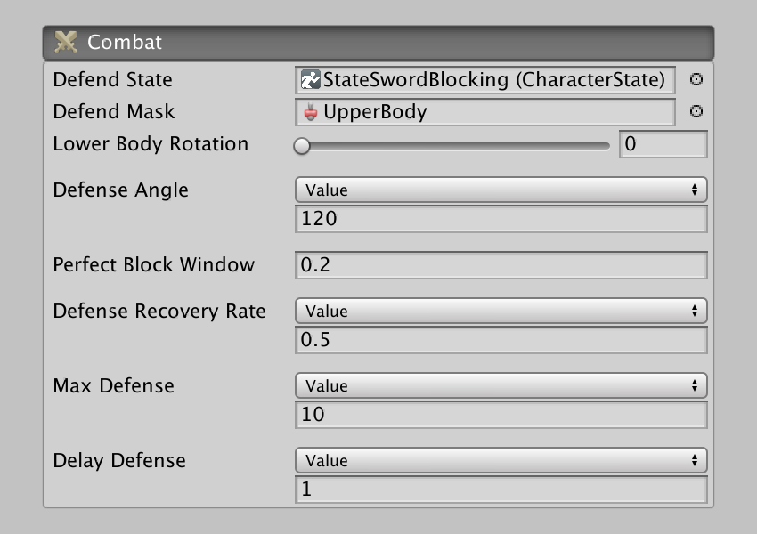

# Shields

**Shield** assets complement **Weapon** assets and provide a way to block incoming attacks, as well as determine how much pressure the wielder can withstand.

There are 3 toggleable sections at the top of the asset Inspector and a bunch of Melee clip animation options below. We'll go over all these from top to bottom.

### General Section

This section looks very similar to the Weapon Asset's homonymous tab. You can define a localized name, description and what 3D object will represent the shield.

It is important to highlight that, contrary to the Weapon Asset's 3D prefab, the Shield 3D prefab field is completely optional. This is due to the system will assume that if no 3D model is used as a shield, the blade of the weapon will be used for parrying.

### Effects Section

This section allows to define which audio sound effects will be played when the character parries or perfectly deflects an attack. It also has a couple of prefab fields that are meant to contain particle effects that will be spawned when the character blocks or perfectly blocks an attack. 


No need to add multiple variations of the same sound effect. The Melee module uses a post-processing algorithm that slightly modifies the pitch and speed of the audio effects played so that the user doesn't notice it's the same sound over and over again.



The prefabs spawned due to blocking are pooled. That means that, if you want to execute an Action as soon as a particle effect prefab is played, you should use the "On Enable" Trigger instead of the "On Start".


### Combat Section

This one is a bit more complex than the previous ones and has a direct influence on how the combat will look and feel.

The **Defend State** field, along with the **Defend Mask**, allows to define the pose in which the character will be when defending. 


Because defending usually only affects the upper body, you can use an Upper Body avatar mask to change the arms position and let the Weapon state deal with the lower body animation. That's how the example provided works.


The **Defense Angle** field determines which angle in front of the character will block incoming attacks. For example, a value of 180 degrees will block attacks from the front and to the sides. Any attacks coming slightly from the sides and to the back will hit the player bypassing the block.


If you want the character to block attacks from any direction, use a value of 360.


**Perfect Block Window** determines the time window for a block to be considered as perfect. A timer starts running when the character starts blocking. If an attack is received before the timer has reached the **Perfect Block Window** timeout, it will be considered a perfect block.

**Defense Recovery Rate** determines the pace at which the character defense meter fills. **Max Defense** determine the maximum amount of defense the character has.

**Delay Defense** determines the amount of time that needs to pass between an attack has been blocked and the defense meter starts filling.


This drastically changes the feeling of a combat. For example, a big and heavy enemy may have a lot of defense, but it recovery rate might be very high. This means that flurry attacks will easily break its defense. On the other hand, if it has high recovery rate, you can chip his defense meter and stay more defensive since, with time, you can get its defense to zero.


### Block Animations

The last section is used for determining which animations will be played when. There are two big groups: _Blocking Hits_ and _Perfect Block Reactions_.

The **Perfect Block Clip** field is an animation clip played by the character performing a perfect block on an enemy. This should be a fast animation and a bit exaggerated, so show a quick reaction time.

A list of Melee Clips called **Block Hit Reactions** is randomly picked when the character blocks an incoming attack. There must always be at least one Block Reaction.


Although the system randomly picks an animation from the Block Hit Reactions list every time a character blocks an attack, it is done so that the same block clip is not played twice in a row.


**Ground Perfect Block Reaction** and **Airborn Perfect Block Reaction** are Melee Clips played when the character gets perfect parried and stumbles back.

