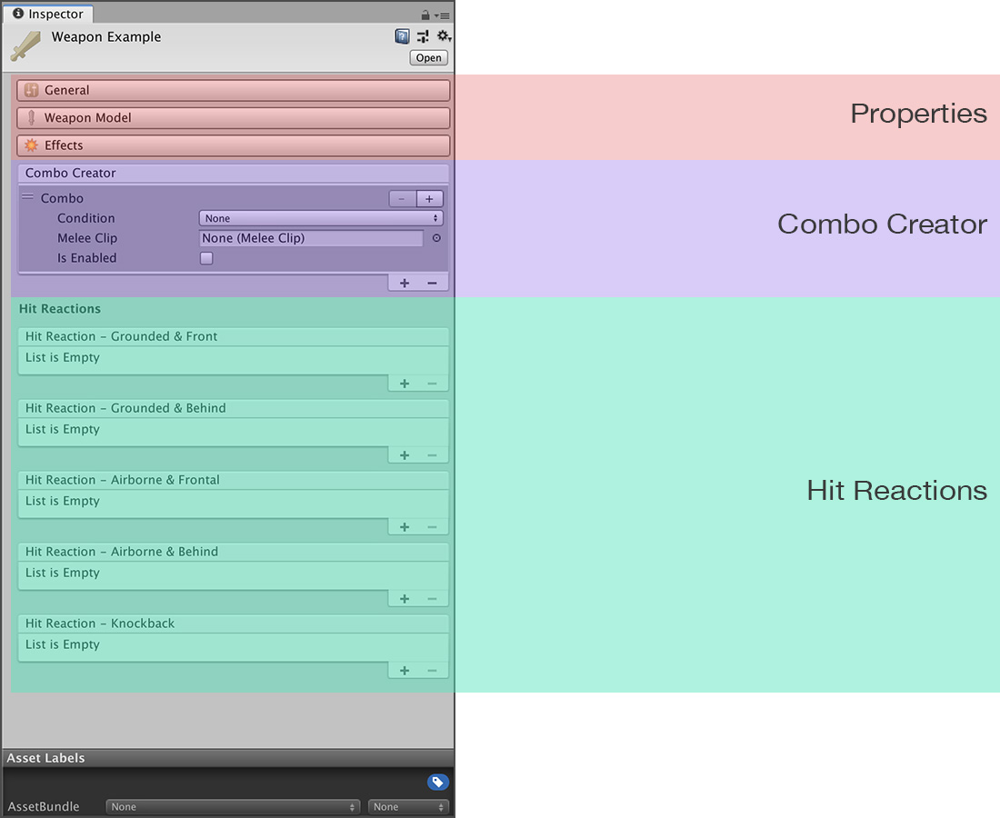
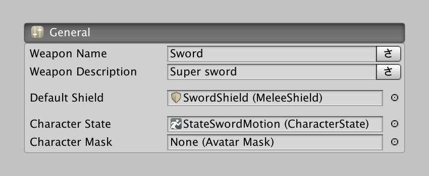
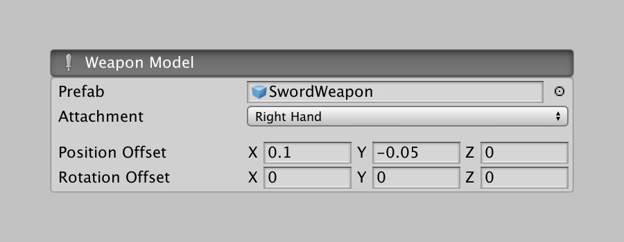
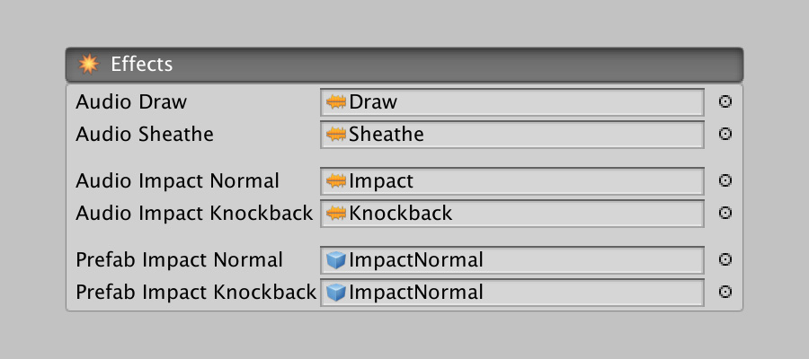
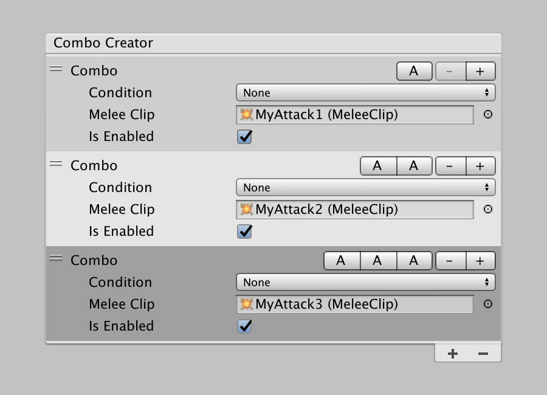
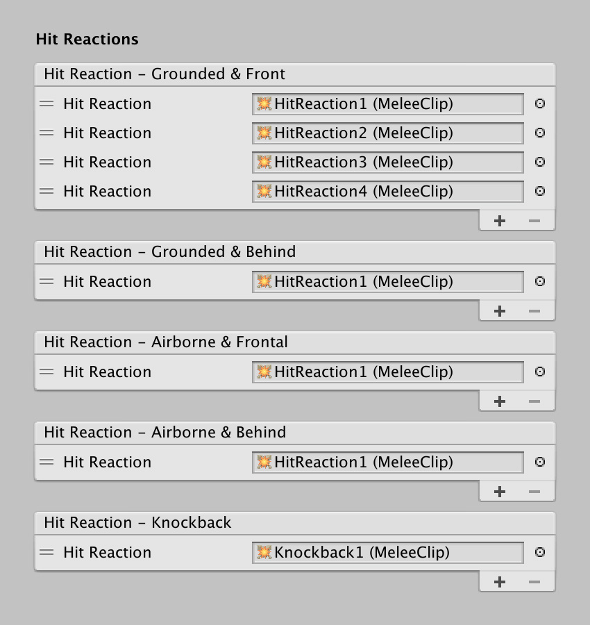

# Weapons

The Weapon asset represents the definition of a specific weapon of your game. From a simple _Steel Sword_ to a _Fire spellbound Battle Axe_.

We'll divide this section of the documentation in three parts.

## Weapon Properties

The Weapon properties is composed of three subsequent sections that define how the weapon behaves and what special effects it plays at certain situations

### General Properties

This section defines basic common parameters that differentiate this weapon from others.

The weapon **Name** and a **Description**, which can be localized to any language the game supports.

The **Default Shield** can reference a [Shield Asset](../shields.md), which will be used when equipping the weapon without specifying a shield.


The **Default Shield** is useful when you want to optionally allow characters to wield a physical shield. 

If, for example, a character wields a sword but no shield, it could still parry attacks using the edge of the sword. In this case, the **Shield Asset** should represent the sword itself.


**Character State** and **Character Mask** lets you define a _Character State_ asset that will be used when the character has equipped the current weapon.


For more information about what Character States are, see the following link: Character [States](../../../game-creator/game-creator/characters/states.md).


### Weapon Model

The **Weapon Model** section defines the physical representation of the weapon the character wields and how it collides and deals damage onto enemies.

The **Prefab** field lets you reference a prefab game object that should contain the 3D model of the sword.


The prefab used as the weapon must always have a **Blade Component**, which is responsible for capturing hit game objects when swinging the weapon. We'll discuss this component a few paragraphs below.

See the [Blade Component](blade-component.md) section for a complete walkthrough of its details.


The **Attachment** field determines to which limb the prefab will be instantiated. Because the weapon can be slightly offset from the center of the limb, you can tweak the position and rotation of the sword using the **Position Offset** and **Rotation Offset** fields.


The **Attachment** dropdown assumes the character that's going to wield the weapon is a humanoid. If you want to use a weapon on a non-human character, select the _Root_ option. This will create the instance of the weapon at the root of the transform.


### Special Effects

The **Effects** section lets you choose which sound effects are played at certain points when wielding the weapon, as well as which particle effects will be spawned.

The field names are quite self explanatory. **Audio Draw** and **Audio Sheathe** are the audio clips played when the character equips and unequips the current weapon.

**Audio Impact Normal** is an audio clip played when the sword hits something and **Audio Impact Knockback** is played when the player gets knocked-back.


**COOL!** Some alarms might have rang in your head when seeing that only a single audio clip field is used for all impacts. When you hear the same noise over and over again, it starts to become annoying.

However, the **Melee** module randomly changes the _tempo_ and _pitch_ of this audio clip so each time you hear it it sounds similar enough to recognize it, but different enough to avoid noticing it's the same over and over again.


Similarly, the **Prefab Impact Normal** and **Prefab Knockback** prefabs are game object prefabs that get instantiated when this weapon hits something or knocks-back something. This is meant to be used for particle and light effects where sparks appear from the clash.


Both **Prefab Impact Normal** and **Prefab Knockback** effects get **pooled** in order to increase performance. 

If you want to execute **Actions** within these objects when they get spawned, use the **On Enable Trigger** option instead of _On Start_.


## Combo Creator

Fighting games would be quite boring without proper combos. Each weapon can have its own set of combo attacks.

A typical combo is smashing the attack key stroke 3 times, and the player character will react executing three consecutive attacks.


Thanks for the built-in **Input Buffer**, you don't need to worry about perfectly timing your attacks. 

If the player presses the attack button very close to when the current attack is about to finish, it will register it and consume the command as soon as the attack is finished.


The main difference between executing a combo attack after another attack is when this second attack starts.

We've already overviewed how an attack is structured: It has an **anticipation** phase first, where the character winds up its attack, an **activation** phase, where the weapon captures hits landed onto enemies, and a **recovery** phase, where the character follows through the attack due to its momentum.

However, a combo chain is supposed to take advantage of the current attack's motion and allow to follow up another one using the momentum of the current one.


This has more to do with anatomy, but if what we have explained before it's a bit difficult to imagine, try the following exercise: _Try throwing a punch with your right hand in front of you as fast as you can_.

Now, while throwing this punch, what is easier and faster to do: retract the right fist and punch again, or wind-up your left fist and throw a punch with your left hand?

Hopefully your answer is the latter: Because while throwing the first punch, you will slightly rotate your torso, which allows to simultaneously wind up your followup attack with your left hand afterwards.


This principle applies to the Combo System: If an attack is marked as a follow-up attack of another one, the Recovery phase of the first attack will be skipped and replaced with the beginning of the next attack.

This is the main principle to having a smooth combat system. If a combo waits until the previous attack is complete to follow up the next one, it will always start from an idle position and making attacks feel powerless.


Take as an example the following clip from **Diablo 3**'s _Barbarian_. You can see how after landing each attack, the _Barbarian_ returns to its idle position before the next attack.


Melee's Combo Creator is always evaluated from top to bottom. As soon as it finds a clip that matches the input and conditions it will stop looking up for an attack and execute the selected one.


This means that the attacks that have higher priority \(or more conditions\) should be placed on top.


Take for example the screenshot from above, which represents a 3-hit combo. A Combo entry is composed of 4 fields:

* **Combo Input:** Determines the combo sequence needed to execute the attack.
* **Condition:** Special conditions that need to be met in order to execute the attack.
* **Melee Clip:** The _Melee Clip_ asset that contains the information of the attack.
* **Is Enabled:** Whether the attack is available by default.


By default all attacks have the **Is Enabled** field enabled. However, if you want to allow characters to unlock combo attacks, uncheck this field and use the "Enable Attack" Action on a character to unlock it

**NOTE:** This is a WIP feature that will be enabled in a future release.


The **Conditions** dropdown allows to define a condition before the attack is executed. These conditions are:

* **None:** No condition is required \(default\)
* **On Air:** The character is airborne
* **After Block:** The followup attack will be executed after blocking an attack
* **After Perfect Block:** The followup attack requires to have perfectly blocked an attack
* **Running Forward:** Requires the character to be running forward
* **Running Backwards:** Requires the character to be running backwards
* **Input Forward:** The forward key button must be pressed
* **Input Backwards:** The backwards key button must be pressed


For a complete combo list, see the example provided with the **Melee** module, which includes _stingers_, special movements and counter-attacks.


## Hit Reactions

The Weapon asset does not only deal with attacking an enemy, but also how attacks affect him/her. The Hits Reaction section allows to configure an arbitrary amount of reactions depending on different situations, but there should be at least one in each case.

You can set any amount of reaction clips at each list. Every time the character has to play a reaction animation, it will scrub through the list and randomly pick one from the corresponding list.


Picking a reaction clip is randomly performed. However, the system is smart enough to avoid playing the same two reactions in a row.


As an example, and using the image above, if the player receives an attack coming in front of him/her, it will pick a random reaction from the first list called **Hit Reaction - Grounded & Front**, which can be any of the 4 different clips attached.

However, if the player gets hit from behind while being grounded, it will always play the same reaction, because there's only one reaction listed under the **Hit Reaction - Grounded & Behind** list.


To see how reactions are created, see the [Melee Clip](../melee-clips.md) asset chapter. It is important to note that reactions should have the "Stagger" option selected under **Pose**. Reactions are meant to take control off the player and this option does exactly that: Forbid the player from executing any input commands.


