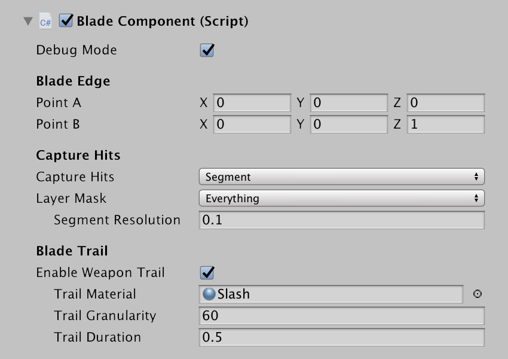
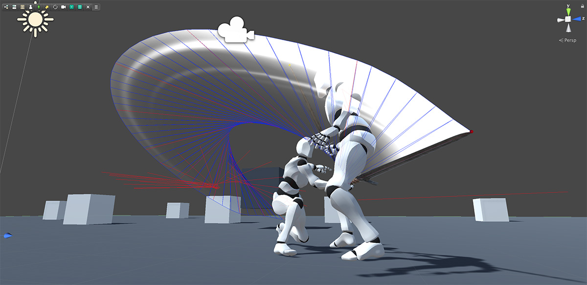
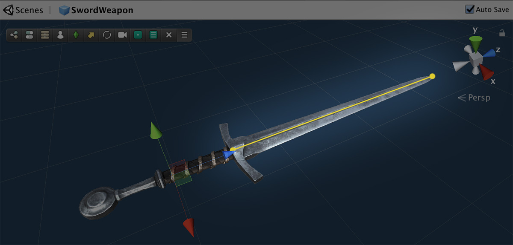

# Blade Component

The **Blade Component** is a Unity component that must be attached to a prefab game object used as the scene representation of a weapon. It serves two purposes:

On one hand, it allows to display _particle_ and _sound effects_ when clashing with other scene objects, as well as show a trail during the activation phase of an attack.

On the other hand, it is also responsible for determining and collecting the enemies hit by the weapon during an activation phase.

**Debug Mode** allows to display internal information about the sword slash. This is useful if you don't have a weapon trail or it's barely perceptible and you want to know why an attack is not hitting an enemy.

### **Blade Edge**

**Blade Edge** positions allow to define a segment that will be used for both the trail of the weapon and detecting hits \(when the weapon is required to\) if the **Capture Hits** dropdown is set to segment.

These **Blade Edge Point A** and **Point B** fields should go along the whole blade \(in case of a _Sword_\) or along the head \(in case of a _Hammer_ or _Axe_\).

### Capture Hits

The **Capture Hits** dropdown allows to select how you want to detect hits using this weapon. As for now you can choose between two options:

* **Segment:** Detects hits by _Raycasting_ along the blade of the weapon \(determined by Point A and Point B\). However, in order to avoid ghosting through objects due to a fast slash, it also checks inter-frame objects. This is determined by the **Segment Resolution**: The lower the value, the more precise. However, it will also be more costly. Something around 0.5 should fit most cases. 
* **Sphere:** Detects hits by casting a sphere at a specific position and processes any objects caught inside. This is the most performant capture mode, and should be used if you're targeting mobile devices or WebGL platforms.

### Blade Trail

The **Blade Trail** is a custom made trail effect used during the _Activation_ phase of an attack. Because most attacks are too fast to be perceived by the human eye, it's a common practice to draw a trail that represents the blur of the moving weapon at a high speed.

This effect can be customized to use a custom **Material** as well as define its **Duration** and how smooth the trail will look using the **Granularity** field.

The _Trail_ will always use the segment defined by **Point A** and **Point B** from the _Blade Edge_ section.

