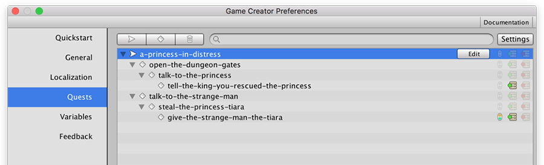
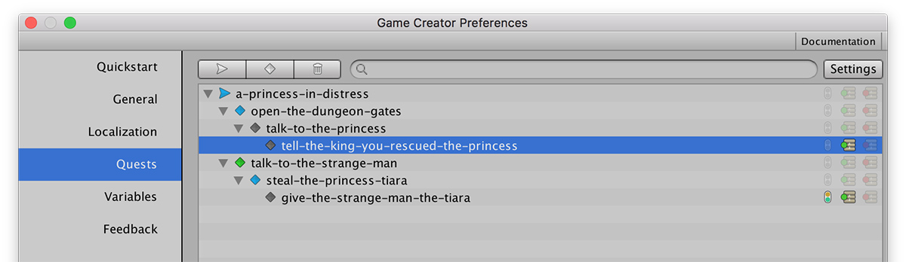

# Create Quests

Before continuing, make sure you've carefully read the [Quests Overview](quests-and-tasks.md) section and you know the difference between **Quests**, a **Quest Root** and **Tasks**. Once you've done that, open the **Preferences Window** \(⌘ + P\) and click on the **Quests** tab.

On the top-left corner of the **Quests Dashboard** there are three buttons with icons. From left to right:

* Create a **Quest Root**
* Create a **Task**
* Delete selection


You can drag and drop the different **Quest** elements and re-order your quests as you want.


The right-most icons indicate if that particular **Quest** element has some **Conditions** assigned before they can be **Activated**, whether it has an **On Complete** set of **Actions** and/or an **On Fail** set of **Actions**.

For example, the **Task** `tell-the-king-you-rescued-the-princess` will invoke a set of **Actions** when it successfully completes, and the `give-the-strange-man-the-tiara` will do the same, but also has some **Conditions** before this quest can be **Activated**.

When selecting a **Task** or a **Quest Root** a small _**Edit**_ button will appear next to these icons. This allows you to modify the **Quests** settings, such as the _Title_, _Description_, ...

## Quests Editor Workflow

Creating **Quests** should be quick and efficient when prototyping quest-lines. That's why each quest has a property called **Internal Name**. This property will never be used in your game and is only used for you to easily identify the quest.


**Internal Names** should have short and concise nomenclature. They can contain spoilers, as they are only used during development.


When creating a new **Quest Root** or a **Task**, the system will assign a randomly generated **Internal Name**. To modify it, simply press _Return_ or _double click_ it to edit it.


**Internal Names** can only contain alphanumeric characters and spaces are replaced by dashes.



When prototyping stories, don't waste time setting the _Title_, _Description_ and other quest details. Instead focus on creating a robust quest line structure using the **Internal Name** properties. Once your story makes sense, you can fill the details.


## Debugging at Runtime

You can open the Quests Dashboard during runtime and its behavior will change. 

Each icon will have its own color, depending on the state of the Quest element and its automatically updated.

* **Grey**: Inactive
* **Blue**: Active
* **Green**: Complete
* **Red**: Failed
* **Orange**: Abandoned


**Incremental Quests** will also display a green bar with the fulfilled percentage. More information about incremental quests [here](quests-and-tasks.md#incremental-quests).



It is highly recommended that you have this **Quests Dashboard** open when testing your storylines.


