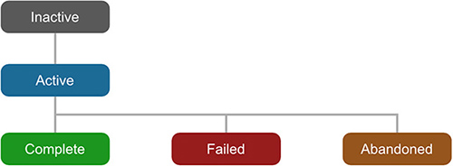

# Quests Overview

Before getting hands on creating Quests and tasks, let's first review a few key concepts.

* **Quests:** Quests are any objective the player \(or any other entity\) has to do in order to change its state. When using the word Quests we both reference **Quest Roots** and **Tasks**.
* **Quest Root:** A Quest Root is the top-level quest that summarizes the entire chain of tasks.
* **Task:** A Task is anything below a Quest Root which defines one single goal. A Task can have any number of children Tasks as well as any number of siblings.

At a given time, a **Quest** element \(**Quest Root** or **Task**\) can be at one and only one of the following states:

* **Inactive:** Default state for any Quest.
* **Active:** The Quest has been discovered
* **Complete:** The Quest has been successfully fulfilled.
* **Failed:** The Quest has failed
* **Abandoned:** The Quest was abandoned. Failed and Abandoned trigger the same effects.


It is important to note that a Complete Quest can't be directly transitioned to Failed. There's a transition dependency from which states one Quest can be transitioned to.



Quest Roots can also be marked as **Tracking**. This will allow the **Journal** and other systems to know which quests are the ones being tracked by the player.



You can also use the **Reset Quest** action if you want to let the players retake a quest-line multiple times.


Apart from the Status and the isTracking property, a Quest also has the following attributes:

* **Title:** A localizable text that serves as the Quest Root/Task title.
* **Description:** A text that contains further details on the Quest. Also localizable.
* **Sprite:** This is completely optional. Some Quests might need to reference a map, a picture or simply have an icon that defines the type of quest. Here you can set it.

Because any **Quest** \(**Root Quest** or **Task**\) can be either **Completed** or **Failed** \(aka **Abandoned**\) it is possible to also assign **Actions** that will be automatically triggered when transitioning to one of these states.

To create the different quest lines, open the **Quests** tab in the **Preferences Window**. More information about creating quests in the next section.

## Advanced Concepts

The following topics are meant to be used for advanced users. If this is the first time you play around with Game Creator or the Quests modules, you might want to skip this so you're not bloated with information.

### Incremental Quests

Most **Quests** allow you to set them as fulfilled when attaining a certain goal, such as discovering a hidden treasure or killing a final boss.

But sometimes you'll want to fulfill a quest upon reaching a certain number of goals. For example, killing 10 bugs, destroying 20 vases or gathering 5 mystical flowers.

For these kind of quests we've created the **Incremental Quests**, which start from a value of 0 and when reaching or overshooting a value of 1 they will automatically be marked as complete with all the effects.


**Incremental Quests** always range from **0** to **1**. If you want to complete a **Task** after killing **5 bees**, you should increment the progress by **0.2** every time a bee is killed.



Use the **Quest Progress** action to add, subtract or set the progress of a Quest.


