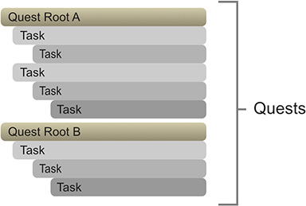

# Quests & Tasks

Before getting hands on creating Quests and tasks, let's first review a few key concepts.

* **Quests:** Quests are any objective the player \(or any other entity\) has to do in order to change its state. When using the word Quests we both reference **Quest Roots** and **Tasks**.
* **Quest Root:** A Quest Root is the top-level quest that summarizes the entire chain of tasks.
* **Task:** A Task is anything below a Quest Root which defines one single goal. A Task can have any number of children Tasks as well as any number of siblings.

At a given time, a **Quest** element \(**Quest Root** or **Task**\) can be at one and only one of the following states:

* **Inactive:** Default state for any Quest.
* **Active:** The Quest has been discovered
* **Complete:** The Quest has been successfully fulfilled.
* **Failed:** The Quest has failed
* **Abandoned:** The Quest was abandoned. Failed and Abandoned trigger the same effects.


It is important to note that a Complete Quest can't be directly transitioned to Failed. There's a transition dependency from which states one Quest can be transitioned to.



Quest Roots can also be marked as **Tracking**. This will allow the **Journal** and other systems to know which quests are the ones being tracked by the player.


