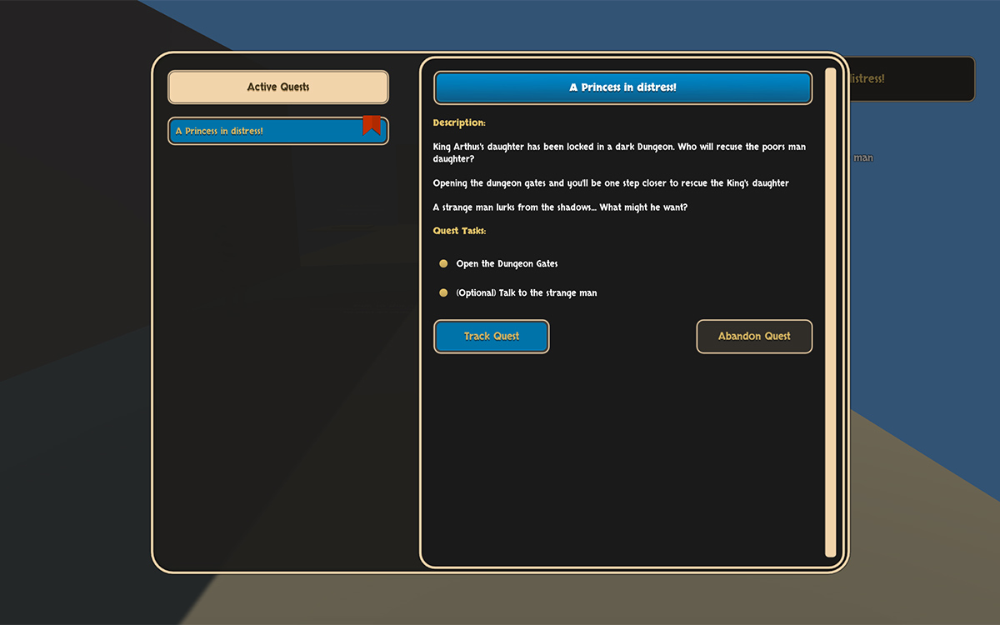
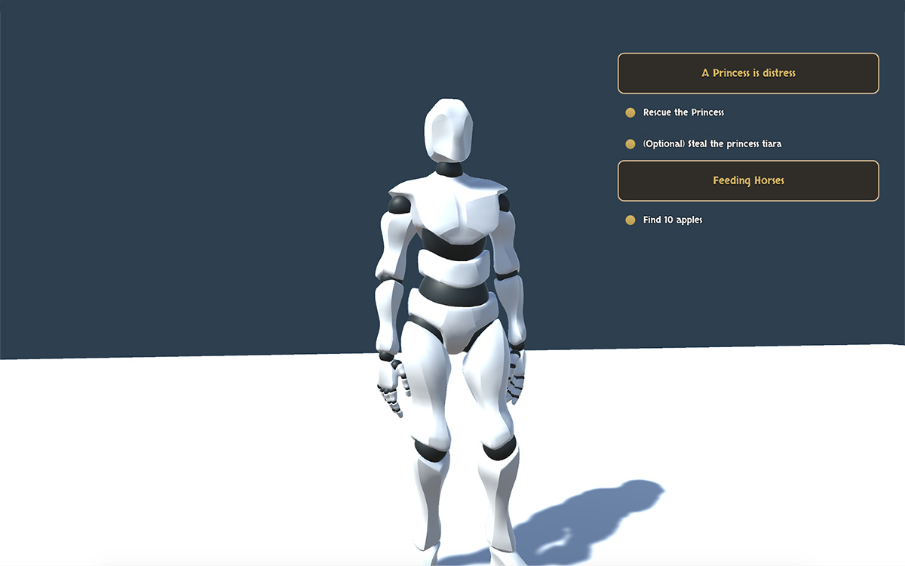

# Quests UI

Setting up **Quests** is not only useful for internally following a structure when telling your story but also a way to inform the player about the next steps.

The **Quests** module comes with a couple of UI assets that provide some basic functionality so you can kickstart your project right away: A **Journal** and a **Quests HUD**.


These are just some example assets that can be built with the **Quest** built-in components. You can learn how to modify or create new ones clicking here.


## The Journal

The **Journal** is a complex user interface. On the left panel there are all the current active **Quest Roots**. Those that are being tracked are bookmarked.

When selecting a **Quest Root**, an in-depth description will appear on the right side. With the default **Journal** you'll be able to see which **Tasks** are active, toggle the tracking property and abandon the **Quest Root**.


You can **show**, **hide** or **toggle** the **Journal** using the **Journal Action**.


## The Quests HUD

The **Quests HUD** is a smaller user interface asset that shows the current active **Quest Roots** and their active **Tasks** below which update in realtime.


You can **show**, **hide** and **toggle** the **Quests HUD** using the **Quests HUD Action**.


