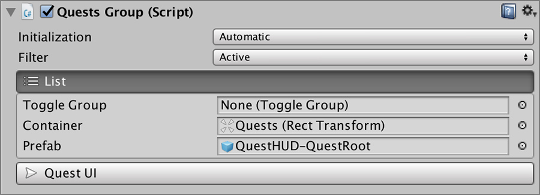
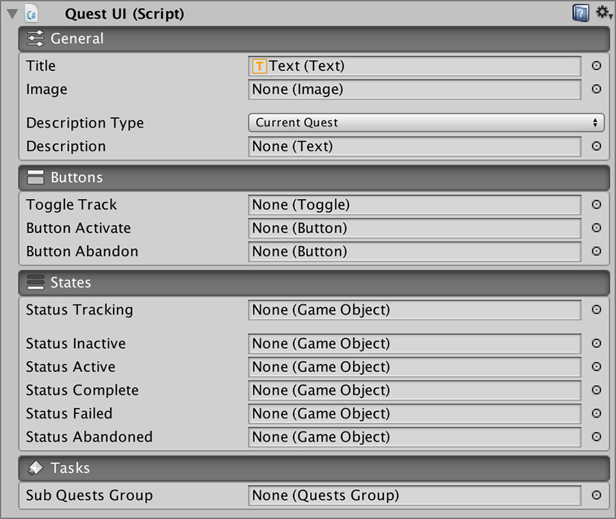

# Custom UI

The **Quests** module comes packed with two assets: the **Journal** and the **Quests HUD**. These assets are nothing more than a combination of default Unity UI components and two Quests components.

## Quest UI Components

Every game has its own unique approach when presenting quests. Some only give you a small text about what to do next, and others may give you a full featured Quest log with history descriptions, detailed tasks and statuses.

That's why we tried to reduce all the complexity to its bare minimum and we came up with just two components:

* Quests Group
* Quest UI

With these two components \(and combining them\) you can create any quest UI.


If you want to create your own **Quest UI** we highly recommend examining and learning how the **Quest Journal** and the **Quests HUD** work by inspecting their component structure.


### Quests Group

The Quests Group allows to filter by **Quest** status and instantiate a prefab per quest.

Initialization has two options; automatic and Manual.

* **Automatic:** Instantiates a list of quests using the specified prefab inside the Container Rect Transform following the filter constraints as soon as it can.
* **Manual:** Does the same as the automatic but needs to be called from another component or script.


The Filter allows you to specify multiple types of statuses. For example, you could display all quests that are complete or active.


The **Quests UI** allows you to specify which component will receive the selected Quest callback from the list of prefabs.

### Quest UI

This component allows you to display all the information relative to a specific **Quest** \(either **Quest Root** or **Task**\).


Every **Quest UI** is optional


The **General** tab allows you to specify which Text components will be updated with the corresponding information about the quest.

The **Buttons** tab allows to trigger different effects, such as toggling the **isTracking** property or abandoning a quest.

The **States** tab will deactivate all game objects but the one which status matches. For example, if the **Quest UI** is bound to a quest which status is **Active**, the **Inactive**, **Complete**, **Failed** and **Abandoned** will be deactivated.

The **Tasks** tab allows you to specify a **Quests Group** component, which will be initialized with the **Tasks** of the current **Quest**.


The **Quests Group** referenced by a **Quest UI** should have the **Initialization** property set to **Manual**. The **Quest UI** will handle initializing it.


