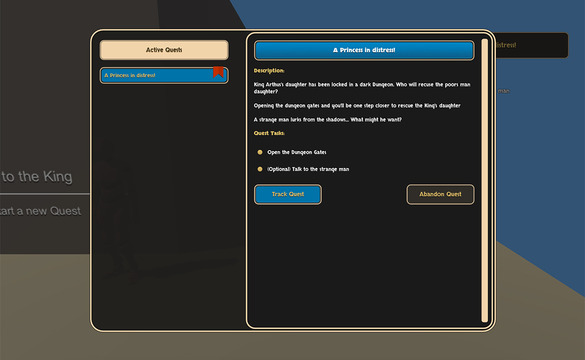

# Quests

The **Quest** module is a **Game Creator** extension that allows to create, track and easily manage game quests.


Download: [gamecreator.page.link/quests](https://gamecreator.page.link/quests)


## Key features 

* Easily create **quests**
* Easy to debug and track quests with Editor built-in tools
* Add **Pre-Conditions** before starting a quest or sub-quest
* Comes with a default \(but editable\) Journal and Quest HUD


**Quests** comes a minimalist skin. You can create your own by duplicating the default ones.


## Setup 

Download the package from the [Game Creator Store](https://store.gamecreator.io) or the **Unity Asset Store**. You'll first need to have **Game Creator** installed.

Then, bring up the _Modules Window_ clicking on the Game Creator option in the toolbar. Click the Quest Module **Enable** button.


This module requires **Game Creator** and won't work without it. Don't attempt to extract the package inside the Plugins/ folder as it will throw some errors.


