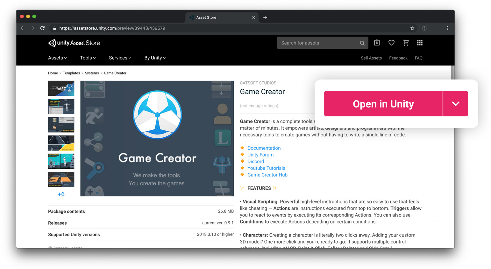
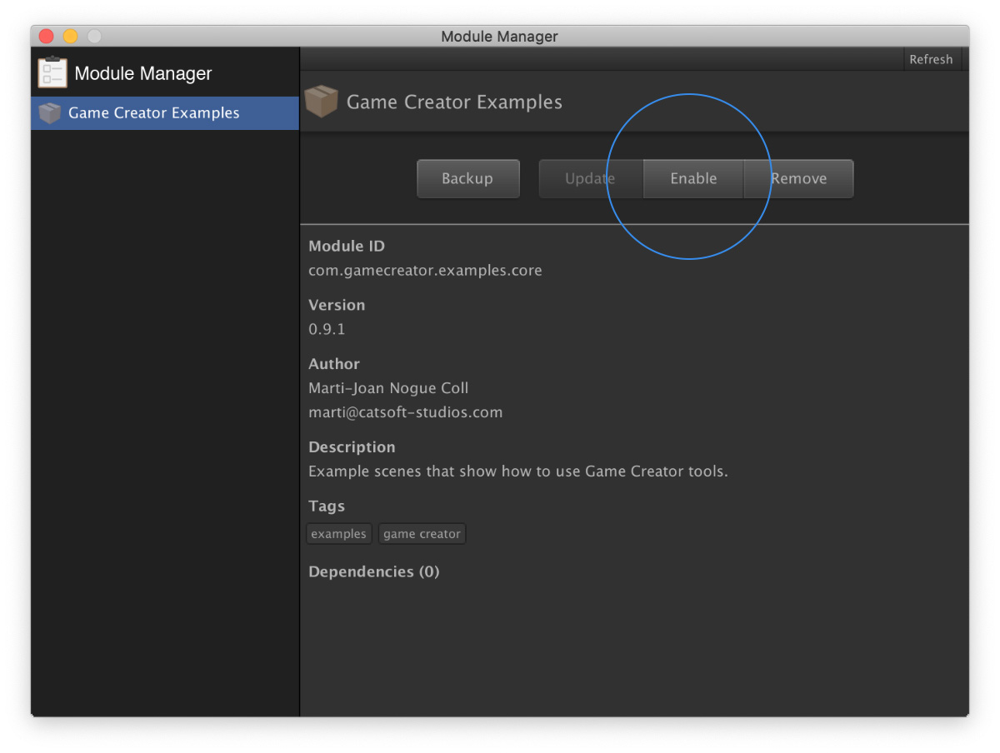

# Setup

Setting up **Game Creator** is really easy.

1. Open the Asset Store and search for Game Creator
2. Download the latest version and check your Unity version is compatible
3. Open your Unity project or create a new one
4. Click on Open in Unity and it will automatically install


Note that Game Creator supports the latest [Unity LTS](https://unity3d.com/unity/qa/lts-releases) version.


Once you have **Game Creator** imported in your project you can start developing your game.

If this is the first time you're using it, we recommend you check out the **Example Scenes**. To open them, simply open the **Module Manager** \[⌘ + Shift + M\] and click the **Enable** button in the option _**Game Creator Examples**_.


The directories **Plugins/GameCreator** and **Plugins/GameCreatorData** and their content must always be at the root of the project and should never be moved.


