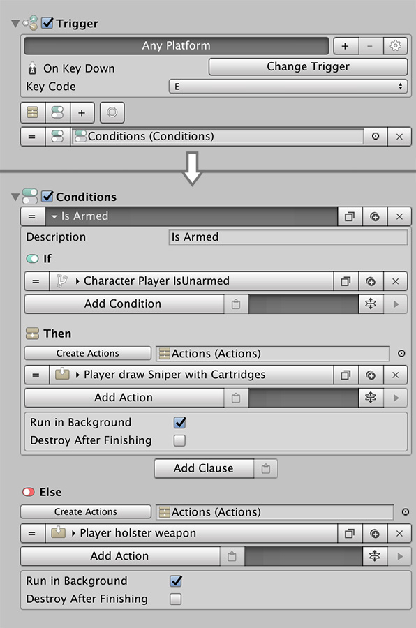

# Shooter

Welcome to the **Shooter** module guide. This is a rather complex system with many configuration options, which allow to create from a top-down perspective shoot 'em up like _Hotline Miami_ to third-person adventure games like _Uncharted_ or _Tomb Raider_.

## Overview

There are two main objects in the Shooter module:

* **Weapons:** A configuration object that lets you define how a weapon is handled, which prefab is used and the States in which the character will pose when aiming with a particular weapon. Requires an Ammo object linked.
* **Ammo:** A configuration object tied to a weapon that defines how a particular ammunition type works, including the effects of shooting, charging a shot or whether it uses a crosshair, a visual trajectory, ...


**IMPORTANT!** 

Do not duplicate or modify the **Weapon** and **Ammo** objects that come as an example. Updating the Shooter module will overwrite your changes. Also, duplicating them will result in keeping multiple-references between the original object and the duplicated one. **Always create a new Weapon and Ammo object from scratch**.

We're working on a solution.



Check the [Weapons](weapons.md) and [Ammunition](ammunition.md) pages for more details about the options they offer.


The **Shooter** module works as a [FSM](https://en.wikipedia.org/wiki/Finite-state_machine) that follows the rules of the diagram below. For example, a Character can not shoot unless it's _armed_ and _aiming_.

To transition between different states you'll need to use the corresponding Action. If a **Character** tries to shoot when it's in a state that doesn't allow to shoot, the system will simply ignore the command.


Using a **FSM** is very useful, as you can create an AI that constantly tries to shoot at the Player as soon as the enemy sees it, without needing to worry about synching times when aiming, drawing the gun, etc...


Here's a quick example on how to make the **Player** draw the **Sniper Rifle** weapon that comes with the **Shooter** module when the user presses the _E_ key.

**Disclaimer:** This is just an example. You can decide how to trigger the drawing of the weapon, whether that's an automatic event as soon as the **Player** enters a zone, pressing a particular keyboard key or even as soon as the game starts. It's 100% customizable!

