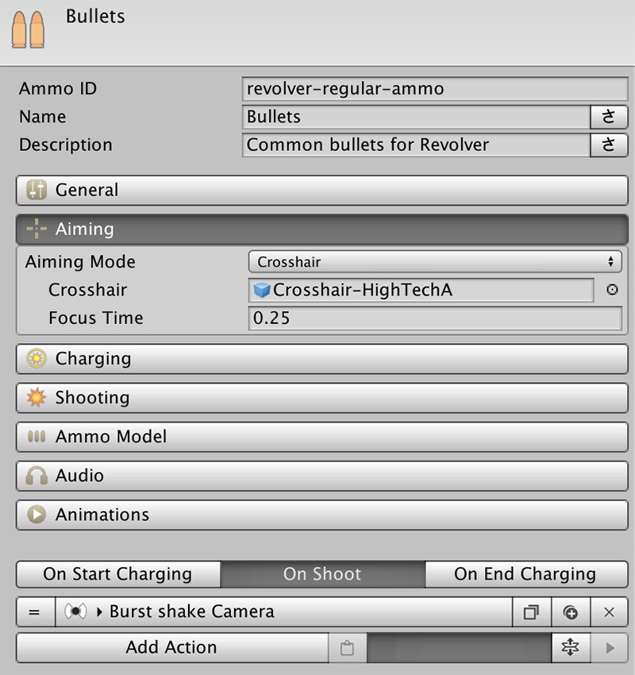

# Custom Crosshairs

**Crosshairs** are one of those things you either love creating or you hate them. They require knowledge about Unity's _Animation_ and _Animator_ tools, so they are a bit advanced. If you're not comfortable using these tools, we'd advice you take a look at the [Unity Manual](https://docs.unity3d.com/Manual/AnimatorControllers.html) first.

To create a **Crosshair** you first need to create a **Canvas** object, like you would normally do for any UI element. Use Unity Image components to design your Crosshair UI. You can use whatever tools you want, but bear in mind that these elements will need to be animated later on.

Once you have your **Crosshair UI** set up it's time to work on the **Animation**.

In your _Project Panel_, create a new **Animator Overrider**. This will be used to control what animation will be played when.

Click on the right dot of the **Controller** and select one called **CrosshairDefault**. This **Animator** will inherit all transitions and parameters from the default one.

Now, all that's left to do is create the animations for when the Crosshair is at its maximum precision and when it's at its minimum.

Once you have these **Animation Clips** created, drag and drop them onto the **CrosshairDefaultMax** and **CrosshairDefaultMin** fields.

You can now save the prefab and exit the prefab mode. Look for your Ammo object you want to use this crosshair with and drag and drop it onto the **Crosshair** field, under the **Aiming** section.

That's it! You can click Play and this crosshair will be automatically used whenever aiming with this ammunition.


The **Shooter** module will take care of creating and destroying the crosshair whenever it's needed as well as interpolate the animations between the ones that were created.


