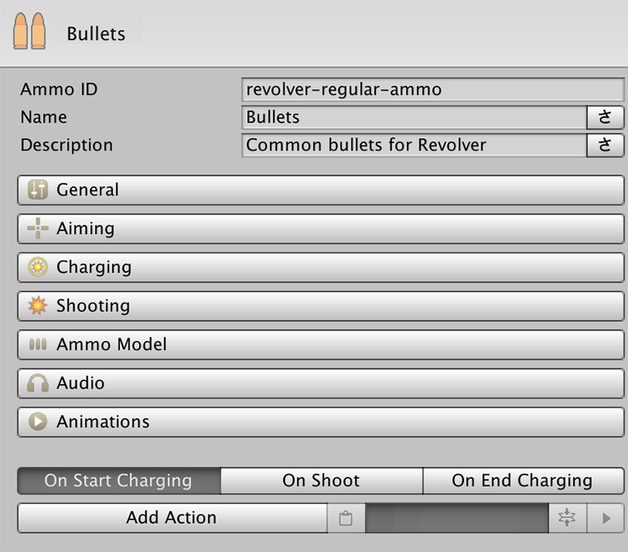
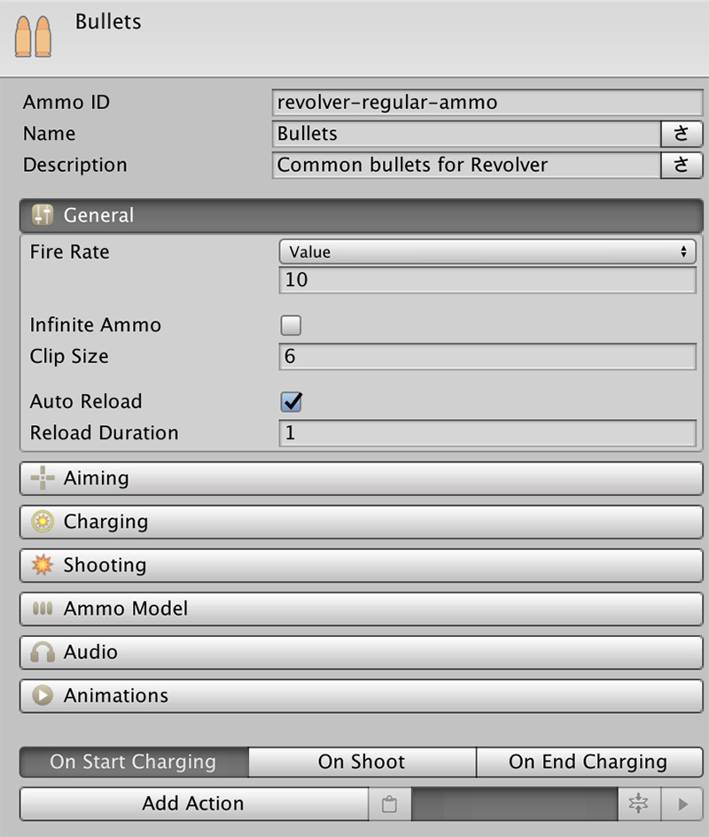

# Ammunition

**Ammunition** \(from now on **Ammo**\) are the other objects used by the **Shooter** module that allow you to create any kind of weapon. **Weapon** objects allow you to define how the **Character** behaves using a certain gun, but **Ammo** allows to define what happens when shooting it, charging shots, how the aiming is done, etc...


**Ammo** objects are more complex than **Weapon** objects. We tried making all concepts as least abstract as possible. In case you don't understand what something does, enter Play mode and play a bit with the values. You'll get immediate realtime feedback when tweaking values from the Ammo objects.


The Ammo object is split in 3 big blocks: **naming**, a few expandable **sections** and the three **Action lists** at the end.

## Naming

This block is very similar to the **Weapon** object. Allows you to give the ammunition a **name** and a **description**. These values can be localized.

It is important to notice there's another field called **Ammo ID**. This field allows to identify the ammunition among the rest. It is important to use a unique value. By default we provide a very long text composed of lower, upper and numeric characters. However, you're feel free to change this for a more meaningful name.

## Sections

The Ammo object is organized in 7 different expandable sections. Each one deals with a particular feature, such as playing an animation when the weapon is shot, how the weapon travels to its destination, etc...

### General

The General section manages common settings related to how the weapon behaves. 

The **Fire Rate** property tells the maximum amount of bullets that the weapon can fire per second. It is important to note that successive bullets fired out of the rate period will be ignored.


Rather than a limitation, this can be used as a feature. When creating enemy AI, you can command enemies to fire their weapons every frame. The **Fire Rate** property will then be in used to cap the amount of bullets that are shot.


