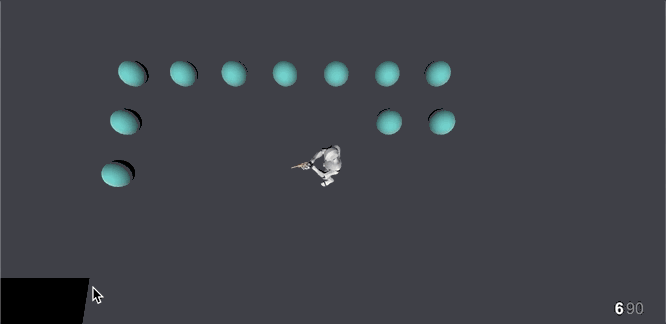

# Ammunition

**Ammunition** \(from now on **Ammo**\) are the other objects used by the **Shooter** module that allow you to create any kind of weapon. **Weapon** objects allow you to define how the **Character** behaves using a certain gun, but **Ammo** allows to define what happens when shooting it, charging shots, how the aiming is done, etc...


**Ammo** objects are more complex than **Weapon** objects. We tried making all concepts as least abstract as possible. In case you don't understand what something does, enter Play mode and play a bit with the values. You'll get immediate realtime feedback when tweaking values from the Ammo objects.


The Ammo object is split in 3 big blocks: **naming**, a few expandable **sections** and the three **Action lists** at the end.

## Naming

This block is very similar to the **Weapon** object. Allows you to give the ammunition a **name** and a **description**. These values can be localized.

It is important to notice there's another field called **Ammo ID**. This field allows to identify the ammunition among the rest. It is important to use a unique value. By default we provide a very long text composed of lower, upper and numeric characters. However, you're feel free to change this for a more meaningful name.

## Sections

The Ammo object is organized in 7 different expandable sections. Each one deals with a particular feature, such as playing an animation when the weapon is shot, how the weapon travels to its destination, etc...

### General

The General section manages common settings related to how the weapon behaves. 

The **Fire Rate** property tells the maximum amount of bullets that the weapon can fire per second. It is important to note that successive bullets fired out of the rate period will be ignored.


Rather than a limitation, this can be used as a feature. When creating enemy AI, you can command enemies to fire their weapons every frame. The **Fire Rate** property will then be in used to cap the amount of bullets that are shot.


**Infinite Ammo** checkbox tells the **Shooter** system to skip checking and subtracting bullets from the magazine. However, notice that, because bullets won't decrease, your clip size will never be reduced and the shooter won't ever need to reload.

**Clip Size** is the amount of bullets that are available to be shot before reloading the gun.

**Auto Reload** allows to immediately reload the weapon when trying to shoot and there are no bullets left in the clip. This is the default behavior in most games.

**Reload Duration** defines how long will it take for a weapon to be reloaded. It is important to mention that this time is also used to stretch or shrink the animation played while reloading.


This is very useful since you can use one single animation clip for two different ammo types, even if one takes 1 second and the other one 5 seconds.


### Aiming

The **Aiming** section deals with how the **Weapon** with this particular **Ammo** aims at its target.


One could argue that aiming should be a **Weapon** section instead of the **Ammo**. This was discarded since a single weapon can have multiple fire modes. 

For example, an _Assault Rifle_ could have both a muzzle to shoot bullets and a grenade launcher attached to it. By having the aiming configured in the **Ammo** object you can have a crosshair for bullets and a trajectory gizmo for the grenade launcher.


The aiming section has an aiming mode dropdown with three options: **None**, **Crosshair** and **Trajectory**. Let's break them down.

#### None

There's no visual indication to how the bullets will be fired. Not commonly used, but if your weapon has a crosshair integrated in your 3D model, it could be useful.

#### Crosshair

**Crosshairs** are the little cross that appear at the center of most first person shooter games. It gives information about where the bullets will impact as well as the current accuracy.

The **Crosshair Mode** displays a couple of properties. **Crosshair** property allows to define the prefab object that will be used when aiming.


 It is important to note that **Crosshair prefabs** require a specific configuration. See [Custom Crosshair](advanced/custom-crosshairs.md) section to know how you can easily create your own.



The **Shooter** module comes with a bunch of **Crosshair prefabs** ready to be used


**Focus Time** defines how long will it take for the weapon to go from _least accurate_ to _maximum accurate_. For example, a value of 0.25 means it will take 0.25 seconds to steady the hand. We'll talk more in depth about accuracy at the Shooting section.


Moving and firing change the current accuracy of the weapon instantly. A low focus time means it will take less time to accurately shoot again.


#### Trajectory

The **Trajectory** aiming mode is the most complex one. It allows to visually display a diegetic line or a gravity-affected trajectory gizmo.


**Trajectory** aiming mode is usually used for projectiles that are affected by gravity, like arrows and grenades. But also can also be used with guns with laser aiming sights.


The first property **Mode** allows to change between a _Curved_ or a _Straight_ line renderer. In either case, you can define an **Offset** in local space from where the line renderer will start.

**Min Velocity** and **Max Velocity** depend on the charge amount.


A Charged Shot is a special kind of shot that winds up over a period of time, at which the velocity of the bullet \(hence, how far it will travel\) will increase up to a maximum.


 The **Min Velocity** and **Max Velocity** tell the minimum velocity at which the projectiles will be shot at each edge of the charged shot. In between values will be interpolated.

To know more about charged shots, see the _Charging_ section.

The **Resolution** property defines how smooth the curved line renderer will be displayed. The curved gizmo is painted using [Line Renderers](https://docs.unity3d.com/Manual/class-LineRenderer.html), and the **Resolution** property defines the length of each segment in the Line Renderer.


Low **Resolution** values will improve the smoothness of the curve, but will also negatively impact performance. Play around with different settings to find the sweet spot between good performance and visual appealing.


The rest of the properties define how the Line Renderer will be displayed, including its **Width**, the **Material** used as well as where the faces of the Line Renderer will face. 

### Charging

Firing projectiles can be done via two different modes: Normal shots and Charged shots. This section deals with the later one.

**Charge Type** is a property that affects both shooting modes; charged and normal shots. This property defines how this ammunition is shot.

* **Disable Charge:** This ammunition can not shoot charged shots. It grays out the rest of the Charging section properties.
* **Require Charge:** The ammo can only shoot charged shots. It will ignore any attempt to shoot normal shots.
* **Optional Charge:** The ammo can both shoot charged shots and normal shots.

**Min Charge Time** is the minimum amount of time needed for a charged shot to be considered as such.


For example, if you have an _Arrow_ with a **Min Charge Time** of 0.5, and the key that charges the shot is released after a time window of 0.3, the shot will be either skipped \(if the **Charge Type** is set to _Require Charge_\) or it will shoot a normal shot \(if **Charge Type** is set to _Optional Charge_\).


**Charge Time** property is the amount of time required to go from a charge of 0% to a 100% charged shot. This value can come from a Global Variable, so it can be dynamically set at runtime \(for example, upgrading the weapon can yield in decreased duration\).

**Charge Value** is an optional property that can be used to store the current charge of the weapon to be used at runtime. This is useful if you want, for example, to display a particle effect when the weapon is fully charged. This can be done by querying the current amount of charge stored in a particular variable.

### Shooting

The **Shooting** section defines how bullets are fired. There are 4 different shooting modes, each of them with its own particular set of properties: **Projectile**, **Raycast**, **Raycast All** and **Trajectory Cast**.

#### Projectile

Shooting **Projectile Type** is the easiest to set up. It instantiates a prefab, defined by **Prefab Projectile**, where the muzzle is and moves it forward. 

If the projectile contains a [Rigidbody](https://docs.unity3d.com/Manual/class-Rigidbody.html) component and the **Aiming Mode** is set to _Trajectory_, it will also apply force based on the **Min Velocity** and **Max Velocity** properties found at the **Charging** section.

**Prefab Muzzle Flash** instantiates a prefab at the muzzle position. This is typically used to play a particle effect.


Instantiating objects takes quite a performance toll on the CPU. However, the **Shooter** module automatically generates a **pool of objects** the first time a weapon is shot, which are lately reused.


Bear in mind that the trajectory computed by the aiming mode doesn't necessarily coincide 100% with where the projectile will land. See the GIF above how the arrow gets stuck just a few millimeters below where the trajectory indicated. This is due to the arrow being computed by a different system \(Unity Physics engine\) than the trajectory gizmo.

#### Raycast & Raycast All

Shooting **Raycast** and **Raycast All** modes \(also know in other engines as hit-scan weapons\) immediately hit the target as soon as the weapon is fired. This is done checking for any collisions between the muzzle and the direction of the muzzle.

**Distance** and **Prefab Muzzle Flash** properties define the maximum distance the collision check will reach. As soon as the scan starts, a prefab \(if any\) will get instantiated where the muzzle is.

If any object is returned by the collision check \(or all of them if the **Shoot Type** is set to _Raycast All_\), an instance of the **Prefab Impact Effect** will be instantiated.


Each instance of **Prefab Impact Effect** will be oriented towards reflected direction between the normal of the collided object and the direction of the scan. This means that if the impact prefab contains an explosion of debris, it should be oriented upwards.


**Layer Mask** allows to ignore objects that are part of the ignored layers. Very useful if you plan on making projectiles penetrate thin surfaces, such as paper walls or water.

If **Push Force** is greater than zero, each object returned by the hit-scan will be examined. If a Rigidbody is found, it will apply an impulse force at the contact point equal to this property's value.

**Shooting Trail** allows to draw a trail that simulates the trail left by the bullet.


This is very useful if you want to hide the fact that bullets travel at the speed of light, giving the players the feeling that bullets are really fast, but not hitting the targets as soon as they are fired.


This effect is achieved by drawing a trail from the muzzle to the object hit, and making the tail of the trail travel towards its head.

You can customize the **Width** of the trail, the **Duration**, which defines how long will it take for the tail to reach the head, as well as change its **Material**. **Alignment** defines where the plane of the trail will be oriented towards and **Texture Mode** how the material will be laid out along the trail.


**TIP:** Increasing the duration of the trail, generally makes weapons feel more powerful.


#### Trajectory Cast

This **Shooting Type** is similar to **Raycast**, but instead of using two endpoints from where to scan for collisions, it uses a curved trajectory.


Contrary to shooting **Projectiles**, which use Unity's Physics engine, the **Trajectory Cast** paired with the **Trajectory** Aiming Mode will yield dead eye precision perfect shots.


All properties in **Trajectory Cast** are exactly the same as **Raycast** and **Raycast All** modes.

**Recoil** defines how much accuracy will be lost after shooting with this ammunition and it is percentage based. 


For example, a _Revolver_ might lose between a 10% and a 50% of the accuracy after firing a bullet, depending on the expertise of the shooter. On the other hand, a Sniper rifle will probably lose 100% of the accuracy after firing, due to the incredible amount of reactive force exercised by the shot.



This has nothing to do with the recoil animation.


**Min Spread** and **Max Spread** define how much accurate the guns are. If the shooter is standing still and the accuracy reticule is at its minimum, it means that the next shot fired will have an accuracy of **Min Spread**. On the other hand, if the shooter is running, the crosshair reticule will be at its widest and the precision of the shot will be **Max Spread**. In between values will be calculated by interpolating **Min Spread** and **Max Spread**.

When shooting with a weapon, the deviation of the shot based on the accuracy is not calculated as a linearly distributed random value, but with a [Gauss-Laplace Random Distribution](https://en.wikipedia.org/wiki/Normal_distribution). 

This results in more realistic shots, where most shots are localized at the center and fewer on the sides.


It is worth noting that **Min Spread** and **Max Spread** values can come from a [Local](../../game-creator/game-creator/variables/local-variables.md) or [Global Variable](../../game-creator/game-creator/variables/global-variables.md). 

This is due to the fact that accuracy is usually linked to the expertise of the gun wielder. You could easily create two Local Variables called **`min-spread`** and **`max-spread`** and bound them to the corresponding values. That way, each character will have different accuracy depending on their skill.


### Ammo Model

### Audio

### Animations

## Actions

### On Start Charging

### On Shoot

### On End Charging

