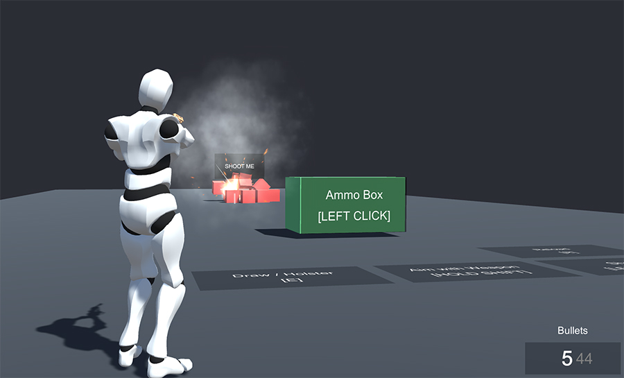
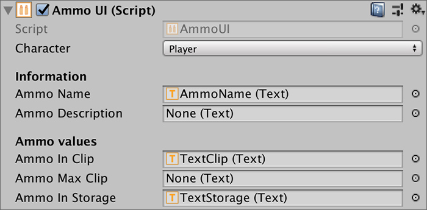

# Example 1 - Get Started

This first example shows how to set up a basic shooter controls, which are later expanded with new features in the rest of the examples. In this section, we'll go over the key elements.

## Player

The Player's configuration is really simple. It's just been added the **`PlayerShooter`** component, which handles ammunition, displaying the correct crosshair \(if any\) as well as keep track of the weapon being used.

## Common Triggers

This prefab is used throughout all the scenes and it's a handy way of reusing the same shooting mechanics in multiple scenes.


The **Weapon** and **Ammo** assets configure how the weapon behaves, but do not bind any key strokes to the shooting, charging and drawing/holstering. This is done using Actions, Conditions & Triggers.


### Drawing & Holstering

Drawing and holstering a weapon is done holding down the **`E`** keyboard button for half a second. This is specified using a Trigger that detects _On Key Timeout_ with the _E_ option.

This **Trigger** executes a **Condition** object that checks whether the **Player** has a weapon at hand or not. If it does not, it uses the **Draw Weapon** action referencing the _Revolver_ weapon asset. Otherwise, it uses the **Holster Weapon** action.

### Aiming

Before shooting with a weapon the character with the weapon must first aim with it. There are multiple aiming systems available, each used in different situations \(for example, it's not the same aiming with a weapon if your game has a top-down perspective, or it is a side-scroll game or a first-person shooter\).

Similarly to the drawing/holstering **Triggers**, we're binding the **`Right Mouse`** key to the aiming. Using a **On Mouse Down Trigger** \(with the **`Right`** option\) will use the **Aim Weapon Action**, whereas another **On Mouse Up Trigger** \(also with the **`Right`** option\) will use the **Aim Weapon Action**, but the option to _Stop Aiming_.

### Charging & Shooting

Shooting a weapon is done via the **Shoot Action**. However, there are two types of shots in the **Shooter** module:

* _Instantaneous shot_, which is how most weapons work.
* _Charged shots_, like bows or grenades, which require wind up time.

If you try to charge a weapon that doesn't allow a charged shot, the **Action** will be ignored. Respectively, if you try to shoot normally a weapon that requires some charge time, it will also be ignored. This limitation is very useful, since you can bind keys to different charge and shooting Actions and only those that suit will be executed.

In this case, we're binding the _Left Mouse_ button to the normal shot, using a **On Mouse Down Trigger** with the _Left Button_ option. This **Trigger** executes the **Shoot Action**.


Notice that the weapon will fire every time the user clicks with its left mouse button. If you want to shoot continuously while holding the left button \(like an assault rifle would do\), you can add a **Restart** Actions right below the **Shoot** Action. This will loop the Action indefinitely. 

To stop the weapon from firing, you'll also need to create a **On Mouse Up** Trigger with the _Left Button_ option, which will use the **Cancel** Action on the previous action. This will force the action responsible for the shooting to exit its execution cycle.


To shoot charged attacks, there are to phases: The charging and the release of the charge. We've bound these mechanics to the left mouse button too, so when the user holds down the shooting mouse button, the player will start charging the attack. When releasing the button, the charged attack will be executed.

To do this, we simply use two **Triggers**: **On Mouse Down** for charging and **On Mouse Up** for releasing the shot.

The **On Mouse Down Trigger** will execute the **Start Charged Shot Action**. The **On Mouse Up Trigger** will execute the **Execute Charged Shot**.


Remember this is just the configuration we decided to use. You can use whatever input schema that suits your game.


### Reloading

The example weapons that come with the **Shooter** module have the _Auto Reload_ option enabled. This means that whenever a weapon's clip is emptied, if the character tries to shoot again, it will automatically enter a reload phase.

However, you can also force a weapon to reload using the **Reload Weapon Action**. We've bound the **`R`** key using a **On Key Down Trigger** which simply calls the **Reload Weapon Action**.


The **Reload** action will be ignored if the character's weapon clip/magazine is full or there's no more ammunition left in the pouch.


## Ammo Box

The **Player** starts the game with zero ammunition. For this reason, we've also created a green box prefab that, when the user is near it and presses the E key, it will refill 50 ammunition of each type. This is done using a simple **On Player Enter Key Trigger** set on the box, which calls an **Action** with the following instructions:

1. Rotate the Player towards the box
2. Play a sound effect \(because it's fancy\)
3. Give 50 Ammo of _Bullets_
4. Give 50 Ammo of _Arrows_
5. Give 50 Ammo of _Fragmentation_
6. Give 50 Ammo of _Cartridges_

You might be asking why all these ammo types are given if this scene just has the _Revolver_ weapon available. This is because this prefab is reused throughout all the examples; We just need to drag and drop the prefab and it automagically allows the player to refill the ammo of all its weapons.

## Ammo UI

In order to display the current equipped weapon as well as the amount of ammunition the Player has \(in his pouch and inside the weapon's clip\), we're using a special component called Ammo UI.

This component has multiple Text references \(all of them optional\) which will update their information based on the Player's current shooter data.

As you can see, the component targets the **Player** as the character that will be used to retrieve information about its shooting data. We're also referencing the name of the ammunition used, the amount of bullets currently inside the weapon's clip as well as how many bullets we have in the pouch.

