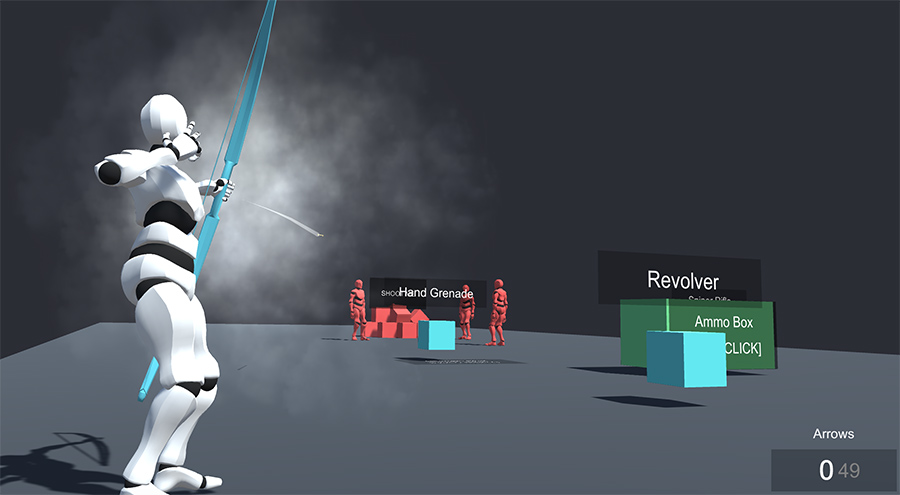

# Example 2 - Pick Weapons

The second example is exactly like the first on, but also allows to pick each of the four example weapons that come with the Shooter module.

To pick a weapon we've build it so the **Player** simply has to pass through the _Blue Cubes_ and it will automatically equip it.


Notice that this is also customizable. You could make a character equip a certain weapon when clicking on it, pressing a keyboard button or even, if you have the [Inventory](../../../inventory/inventory/) module, pull the weapon when an item is equipped \(in the Inventory\).

This shows how versatile the system is and how it can be used seamlessly with other modules.


These cubes are very simple: They have a **On Player Enter Trigger** attached which executes an **Action** with just one instruction: **Draw Weapon**. Each cube draws a different weapon, which is informed to the user using a _Canvas_ with a _Text_ on top of it.

