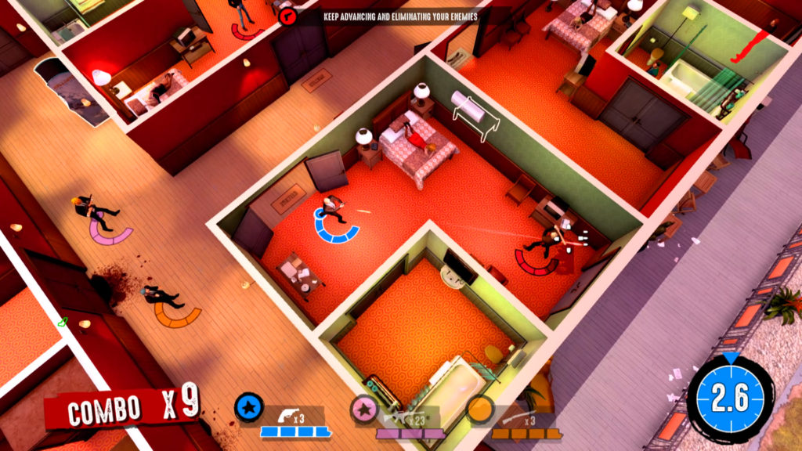
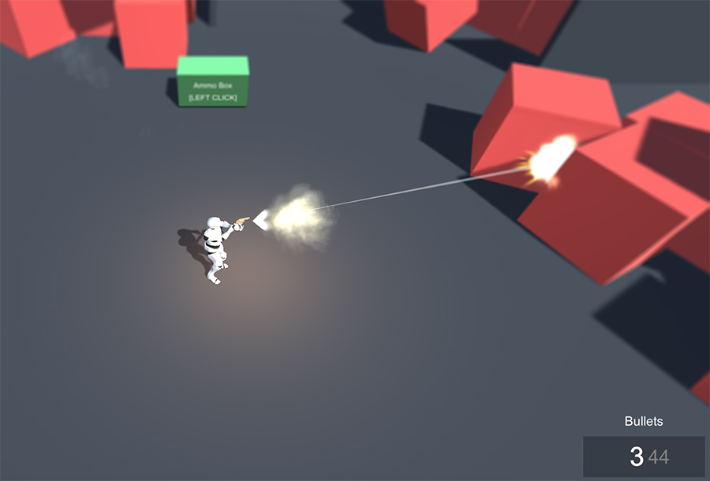

# Example 3 - Top Down

Top-Down perspective games are very common and are very fun to play. They allow a wide bird-like view of the battlefield, sacrificing immersiveness. This games usually have fast paced combat.

Setting up a top-down Shooter is really easy. All that is needed is a Follow Camera Motor where the Y component is very high \(so the camera follows the Player from up in the air\).

In the **Shooting** module part, what changes is the aiming mode. If you open the _TriggerAim_ prefab in the Top-Down scene, you'll see we've modified the **Weapon Aim Action**, which now uses the **Aim Ground Plane**. This will tell the character that its target is the position of the mouse projected on the ground where the **Player** is standing on.

