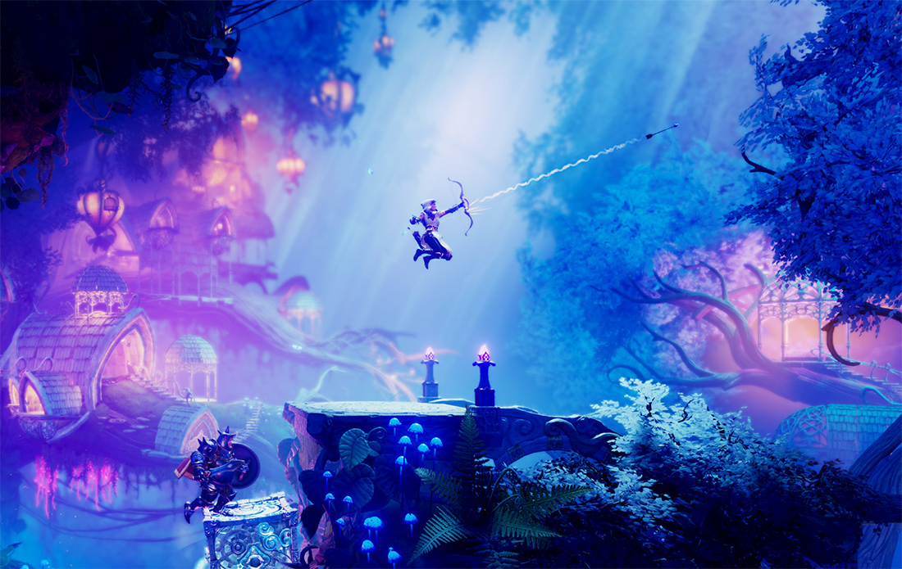

# Example 4 - Side Scroll

Side-Scroll are 2D games that are played from the side, where characters can only go left or right. This type of games reward exploration as the player can usually jump between platforms. Combat is also a fundamental part of side-scroll games, since you can precisely see the trajectory of your weapons as well as predict enemy's projectiles.

Similarly to Top-Down games, to set up a side-scroll game with Game Creator is as easy as using a Follow Camera Motor that tracks the player's position from the X or Z axis \(depending on what your games considers forward\).

You also have to make sure the Player's Input is set to Side-Scroll. This allows the Player to only move right or left. You'll find these options at the Player Character component in the Inspector.

For the shooting part, the aiming mode property of **Weapon Aiming Action** must be set to **Aim Side Scroll**.

