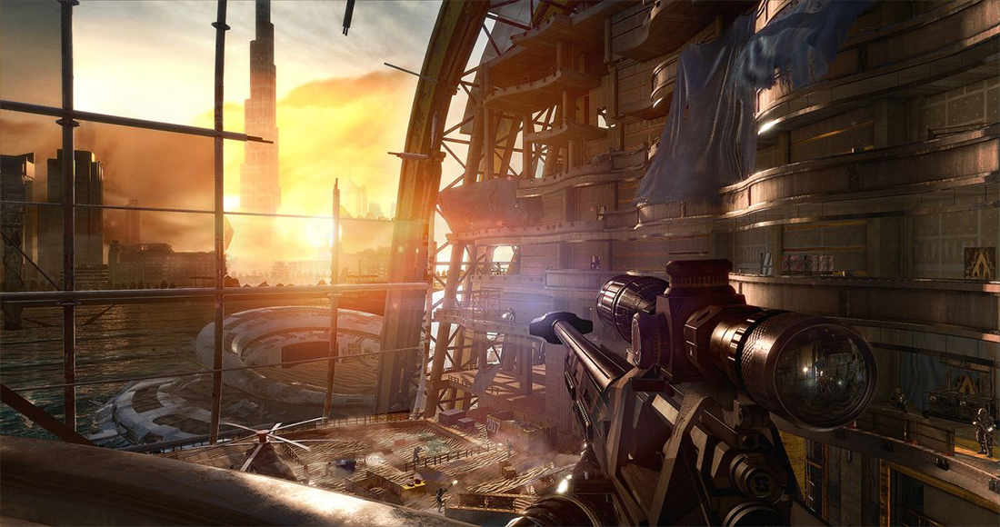
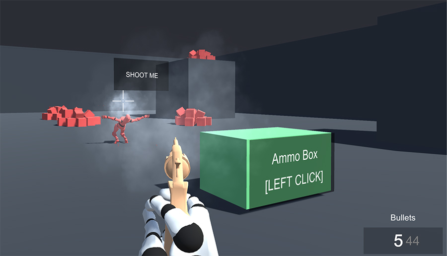

# Example 5 - First Person

First Person shooting games have been around since they were first introduced by Doom, back in 1993. They offer the most immersive experience, sacrificing depth and surrounding awareness.

Game Creator and the Shooter module come with tools that allow you to easily create a game using this perspective. For the Player, it is recommended that the model is headless. Otherwise, it could clip through the camera.


It is important to note that body animations in first-person games are very different from other perspectives. The reason behind this is that, while we walk or run, our body moves a lot, but our brain is used to stabilize the image received through our eyes.

However, in a video game, our brain doesn't stabilize the image for us, provoking motion sickness. To solve this, it's better to use very stiff animations for first person games. Take a look for example at Mirror's Edge body animation from a third-person perspective: [https://www.youtube.com/watch?v=6O6OTgiFzuI](https://www.youtube.com/watch?v=6O6OTgiFzuI)

You'll notice that the body barely moves, allowing the head to be very steady.


In order to shoot in first person mode, the **Weapon Aiming Action** must be set to **Camera Direction**. This will allow the bullets to travel to whatever the camera is facing.

