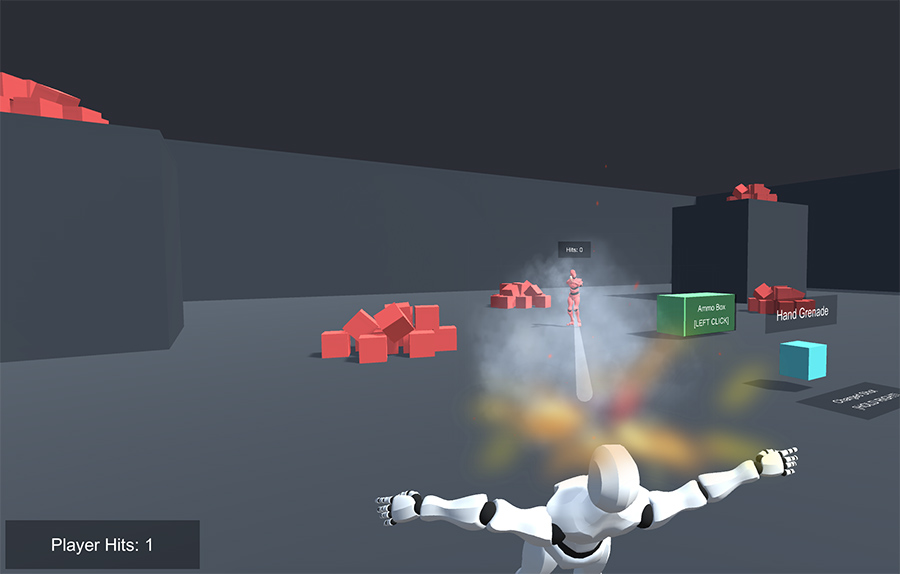
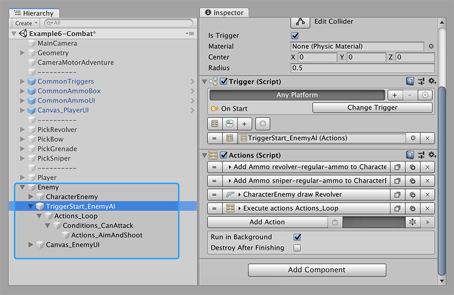
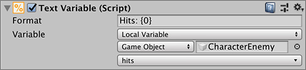

# Example 6 - Combat

The Combat example scene puts together everything we've seen so far and allows the player to fight an enemy.

The enemy uses a **Revolver**, but could be using anything. Here are the steps we took to build this scene:

## Enemy AI

The first thing we need to do is have a working enemy that is flexible. We've chosen to create a very simple system, but this could be easily expanded to make _smarter_ decisions based on context.


Using the [Behavior](../../../behavior/behavior/) module allows to more easily create enemy and ally AI. It also allows to create intricate AI behaviors and both the **Shooter** and the **Behavior** modules work seamlessly together.


The basic structure of the enemy is a looped action that looks for the **Player**, follows it for around 1 second, aims with the gun and shoot. This process is repeated indefinitely.

But before getting into the main enemy cycle, let's see how everything is initialized. It all starts with the **On Start Trigger** located at the **`TriggerStart_EnemyAI`** object. This **Trigger** is executed as soon as the game begins and gives the enemy 100 ammo for the revolver and sniper \(**Sniper** rifle is not used, but it's there in case you want to swap weapons\). It then draws the **Revolver** and starts executing an **Actions** component from a child object called **`Actions_Loop`**.


If you want the enemy to use another weapon, you can expand the **CharacterEnemy draw Revolver Action** and change the weapon used. 

The _Sniper_ rifle will work out of the box, but you'll need to set the charging actions for the _Bow_ and _Grenade_ weapons.


The **`Actions_Loop`** **Actions** calls a **Conditions** object called **`Conditions_CanAttack`**, waits for it to finish and restarts the **Actions** using the **Restart** instruction. This allows the system to loop continuously.

The **`Conditions_CanAttack`** **Conditions** checks if a **Local Variable** **`can-attack`** is true or false. If it is true, it executes a list of Actions where the enemy:

1. Follows the player for a few seconds
2. Stops following and looks at the Player
3. Aims with the gun
4. Waits just a few milliseconds
5. Shoots with the weapon
6. Stops aiming with the gun


The **`can-attack`** variable is used to know if the enemy can attack the player or This is primary used in case the enemy shoots the player and shoots him again, and again and again while the player is on the floor, getting him stuck in a a never ending loop where the Player can't stand up before getting shot.



We added a few milliseconds between the **Actions** of aiming at the **Player** and shooting with the gun, because if not, the enemy would never miss the shot. Adding a few milliseconds between the aiming and the shooting allows the **Player** to be out of the trajectory if moving.

**TIP!** This is commonly used in games that allow to have different difficulty settings. Playing games on high difficulty means the time window between aiming and shooting is lower, hence, increasing the accuracy of enemy's shots.


## Score

Every time a character \(either the _Player_ or the _Enemy_\) gets shot, a hit-counter is increased. To do this, we've created a **Numeric** **Local Variable** in each character called **`hits`**. This value is increased in each character on the received end of the shot.


Making a health bar is practically the same as using this hit system. But instead of a variable that goes up each time the character gets hit, it decreases its value.

You will also need a **Condition** that checks if the value has reached 0, it will execute the **Actions** showing the character die \(or display a _Game Over_ screen in case it's the player\).


To detect when a character receives a shot we use the **On Receive Shot Trigger**. This **Trigger** is executed every time the collider attached receives a shot \(you can filter by any type of shot, normal or charged shots\).

Upon executing this **Trigger**, we execute an **Action** that increases the value of the hits variable by one.

There's only one thing left to do, which is display the value of the hit variable and update it every time this changes. This can be easily done using a **Game Creator** component called **Text Variable**. A **Text Variable** component looks like a Unity **Text** component, but also has a field to specify a **Local** or **Global Variable**. 

This allows to display and automatically update the text every time the variable value changes. Repeat this process for both the _Player_ and the _Enemy_ and you're all done!

