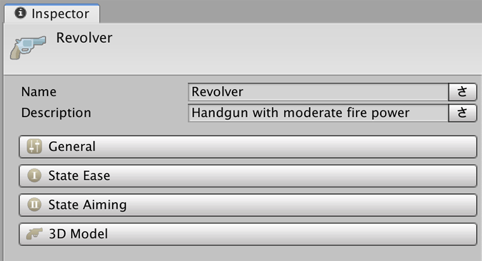
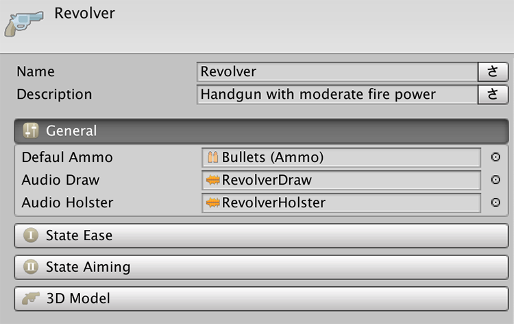
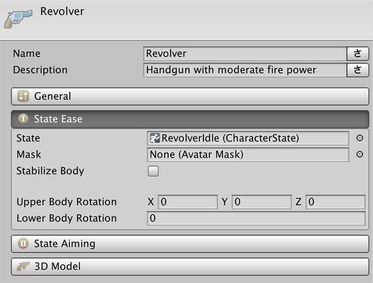
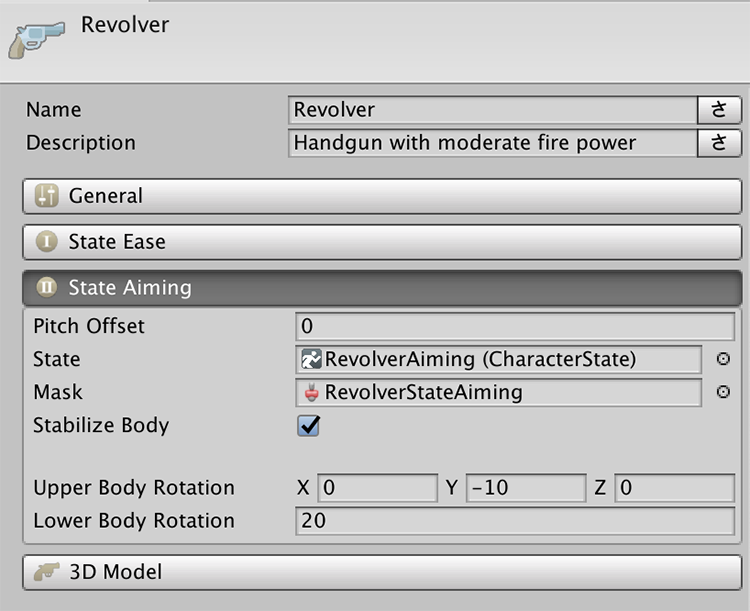
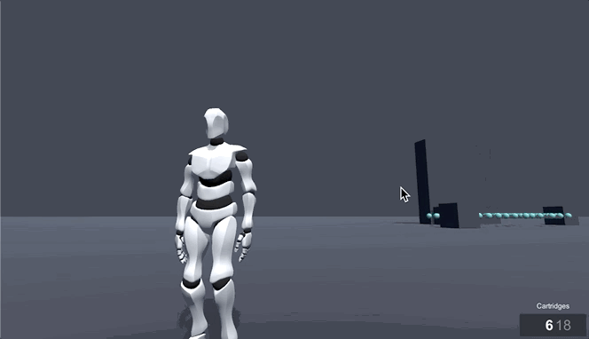
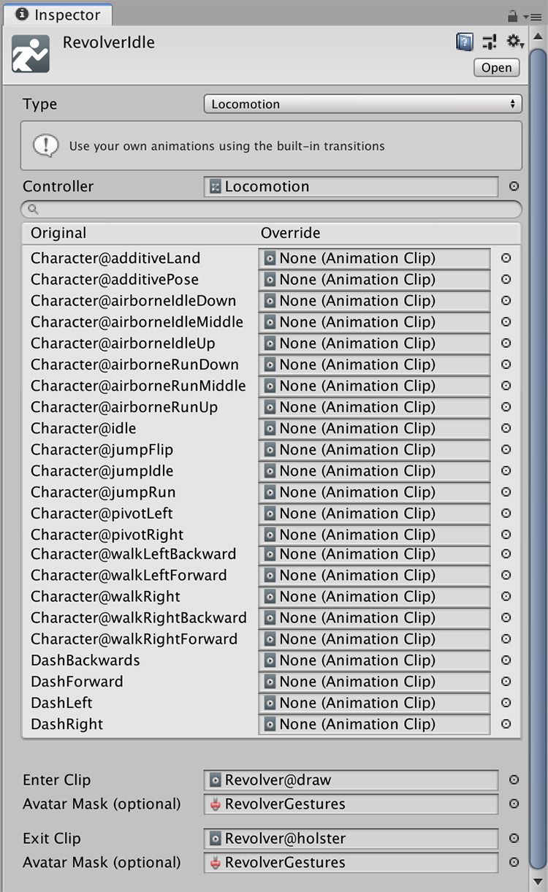

# Weapons

**Weapons** are scriptable objects that allow to configure how a weapon looks like, how to hold it, as well as link it to a particular **Ammo** object.


A **Weapon** has some required fields that must be filled. If these are not correctly set up, an error message will be prompted.


## Fields Overview

We'll overview each of the fields from top to bottom. Both the **Name** and the **Description** are quite self explanatory and are primary used when displaying the name of the currently active weapon on a UI canvas.

### General

This section allows to configure some general settings, such as the sound effects played when _drawing_ and _holstering_ the weapon.

The **Default Ammo** field is a required one that is used when a **Weapon** is equipped but no ammunition is specified.


Click on [Ammunition](ammunition.md) for more information on the **Ammo** object.


### State Ease & State Aiming

When a **Character** pulls a weapon, it automatically enters a _At Ease_ state, in which the Character can freely move with the weapon at hand.

The State Aiming section allows to configure how the Character will behave when, with a weapon at hand, it aims at a target.


Not all games have an _ease_ mode. If you want to go from an _unarmed_ state to _aiming_, simply add the **Aim Action** right after the drawing the gun.


We'll cover these two sections as one, since most of the fields are shared.

**Pitch Offset:** This property is exclusive of the **State Aiming** and allows to modify pitch \(up and down\) angle in which a weapon is aiming. 


This should always be 0, but it's there in case your animation has a slight precision error. For example, if your weapon points forward but the character looks like it's aiming down, you can increase the value and the character will aim higher.


**State and State Mask**

These are one of the most complex properties to set. The **Shooter** module is heavily animation driven and relies a lot on the Game Creator's custom animation system. 


If you are not familiar with the **State** and **Gesture** concepts, we recommend you first take a look at this section: [States](../../game-creator/game-creator/characters/states.md) & [Gestures](../../game-creator/game-creator/characters/gestures.md).


Let's explain these concepts using the _Revolver_ example. When the **Character** draws a gun, it plays an animation where its right arm reaches to its back and picks a revolver. After that, the character changes \(or not\) its stance.

This is done using a **Locomotion State**, which allows to have an animation clip played when entering the State \(drawing the gun\) as well as another one when leaving it \(holstering the weapon\).


Notice how the _At Ease_ **Locomotion State** is an empty locomotion object with just a couple of animation clips at the end. This is due to the animations used when the Character is armed an unarmed are the same. 

If you'd like to change the stance of the **Character** when holding a weapon, you could create custom animation clips and drop them in their corresponding field.



Notice also how the **Enter Clip** and **Exit Clip** fields have an **Avatar Mask** field. This is used to play an animation clip only on certain parts of the body. 

Because we want to be able to draw a gun during any locomotion state \(idle, running, jumping, ...\) we can use an **Avatar Mask** in order to play the animation only on the right arm, while the base locomotion play normally.


