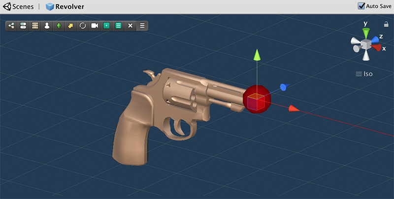

# Weapons

**Weapons** are scriptable objects that allow to configure how a weapon looks like, how to hold it, as well as link it to a particular **Ammo** object.


A **Weapon** has some required fields that must be filled. If these are not correctly set up, an error message will be prompted.


## Fields Overview

We'll overview each of the fields from top to bottom. Both the **Name** and the **Description** are quite self explanatory and are primary used when displaying the name of the currently active weapon on a UI canvas.

### General

This section allows to configure some general settings, such as the sound effects played when _drawing_ and _holstering_ the weapon.

The **Default Ammo** field is a required one that is used when a **Weapon** is equipped but no ammunition is specified.


Click on [Ammunition](ammunition.md) for more information on the **Ammo** object.


### State Ease & State Aiming

When a **Character** pulls a weapon, it automatically enters a _At Ease_ state, in which the Character can freely move with the weapon at hand.

The State Aiming section allows to configure how the Character will behave when, with a weapon at hand, it aims at a target.


Not all games have an _ease_ mode. If you want to go from an _unarmed_ state to _aiming_, simply add the **Aim Action** right after the drawing the gun.


We'll cover these two sections as one, since most of the fields are shared.

#### **Pitch Offset**

This property is exclusive of the **State Aiming** and allows to modify pitch \(up and down\) angle in which a weapon is aiming. 


This should always be 0, but it's there in case your animation has a slight precision error. For example, if your weapon points forward but the character looks like it's aiming down, you can increase the value and the character will aim higher.


#### **State and State Mask**

These are one of the most complex properties to set. The **Shooter** module is heavily animation driven and relies a lot on the Game Creator's custom animation system. 


If you are not familiar with the **State** and **Gesture** concepts, we recommend you first take a look at this section: [States](../../game-creator/game-creator/characters/states.md) & [Gestures](../../game-creator/game-creator/characters/gestures.md).


Let's explain these concepts using the _Revolver_ example. When the **Character** draws a gun, it plays an animation where its right arm reaches to its back and picks a revolver. After that, the character changes \(or not\) its stance.

This is done using a **Locomotion State**, which allows to have an animation clip played when entering the State \(drawing the gun\) as well as another one when leaving it \(holstering the weapon\).


Notice how the _At Ease_ **Locomotion State** is an empty locomotion object with just a couple of animation clips at the end. This is due to the animations used when the Character is armed an unarmed are the same. 

If you'd like to change the stance of the **Character** when holding a weapon, you could create custom animation clips and drop them in their corresponding field.



Notice also how the **Enter Clip** and **Exit Clip** fields have an **Avatar Mask** field. This is used to play an animation clip only on certain parts of the body. 

Because we want to be able to draw a gun during any locomotion state \(idle, running, jumping, ...\) we can use an **Avatar Mask** in order to play the animation only on the right arm, while the base locomotion play normally.


#### Stabilize Body

This option is a bit of a blackbox that _magically_ makes your character's upper body stand straight, despite of the animation.

This is done using a custom algorithm that reads information about the character's hip and spine rotations and compensates their movement in order to keep the whole upper body steadier.


This option is particularly useful on the **Aiming State**. It allows to rotate the hips and spine in order to compensate the noise produced by any lower body movement. This will allow to automagically have a much steadier weapon holding hand.


Notice how on the right side of the previous GIF, all bones from the shoulder to the hand stand very steady, whereas on the left side, all bones inherit the movement from previous bones, resulting in a lot of added noise at the tip of the gun.

#### Upper Body Rotation

This property allows to rotate the low spine bones of the Character in order to more accurately represent how the weight of the weapon affects the balance of the Character.


Use low values on the _Upper Body Rotation_, as higher ones will most likely make the Character twist the body in an unnatural way. Unless that's what you're going for :-\)


#### Lower Body Rotation

This property is very useful for quickly creating different stance poses from a single State, without having to create an entire [Locomotion State](../../game-creator/game-creator/characters/states.md). 

Not all weapons are held the same way; most of them modify where the feet point at in relation to the forward direction of the gun. For example, when aiming with a gun, the character will usually have their feet pointing at around 20 to 30 degrees from the character's eye direction. Other weapons, like the bow, tend to rotate the lower body up to 90 degrees, making the head look through the shoulder.


Finding a good _Lower Body Rotation_ is a matter of taste. While in Play Mode, you can modify these values in order to instantly see how they affect the character in realtime.


### 3D Model

This section allows you to define what the visual representation of the weapon will look like. However, the weapon serves also another important purpose, which is telling the direction of this one as well as where the **Muzzle** is.

You can define what prefab object will be used as a weapon as well as which bone is it going to be attached to. 


You can also offset the position and rotation of the prefab relative to the bone attached. the best way to find these values is to start with a default position and rotation of \(0,0,0\) and click Play. 

Once in play mode, equip the weapon and manually position where it should fit. Now, copy down the values of the 3D model's position and rotation from its Transform component. These are the values that should be set in the 3D model.


#### The Muzzle

As mentioned before, the 3D Model prefab used as a weapon serves two purposes: visually represent the weapon and tell Game Creator where the muzzle is and what direction is forward.


For this, there's a special component that is **required** for all prefab models called **Weapon Muzzle**. See the following screenshot as an example of the Revolver's Muzzle Component.


The **Muzzle Component** can be added anywhere in the 3D Model prefab object, as its value is searched and cached the first time weapon is equipped. It is important to place it at the tip of where the muzzle flash is going to appear.


**Advanced Tip:** 

The **Muzzle Component** also has an optional property called **Animator**. This allows you to add a custom _Animator Controller_ that reacts when the weapon is charged and fired. For example, the bow has an _Animator Controller_ that will pull the string backwards depending on the value of a _Charge_ \[Float\] parameter.


