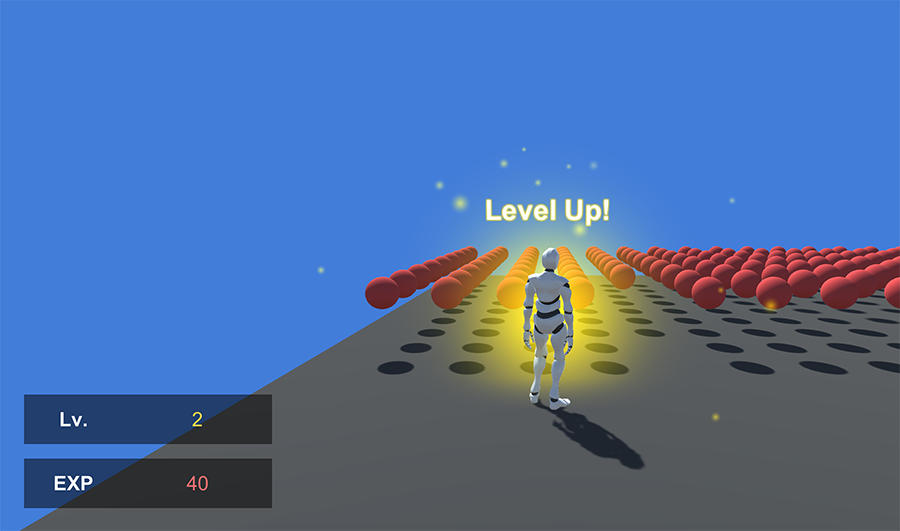

# Levels and XP

Until now everything's been quite simple, right? Let's spice things up! One of the most frequently asked questions is how to implement a good **Level**/**Experience** system.

## Preface

Do you want the player to get perk points he can spend on skills after completing tasks? Or do you prefer to have a common experience system where each level requires an ever-increasing amount of experience? Maybe you could increase the value of each stat depending on how much you make use of them.

There are countless ways of implementing a progression system. That's why we decided to let you choose what's the best way of doing it for your particular game.

But let's get down to business. The typical _RPG_ progression system consists of a series of threshold levels of experience upon when reaching them, the level amount is increased by one.

## Level & Experience

We'll need a couple of **Stats** to implement this system:

* **Experience Stat:** When the player kills or completes quests, he'll increase the amount of experience points he has. These points will be used to determine the current level.
* **Level Stat:** Depending on the amount of experience points the value will vary.


Notice that the **Level Stat** depends exclusively on the **Experience Stat** and it is perfectly fine.


The **Experience Stat**'s formula is the same as the **`health`** one, which returns the current value of the stat using the **`this[value]`** expression. So if the player has accumulated 100 of experience points, the formula will return the same number.

What's interesting is the **Level Formula**, which uses the **Progression Table**.

![\(Level Formula with table\(stat\[exp\]\) as its expression\)](../../../.gitbook/assets/stat-example-4-level.png)

