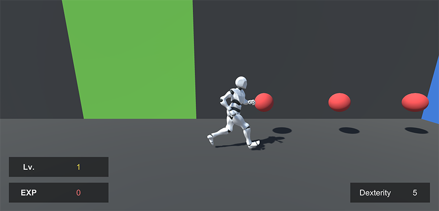

# Lockpicking

If you are reading this means you should already be an expert using the **Stats** module. This time we won't be covering a new feature, but show you how can you use the **Formulas** and **Stats** for other things that aren't tightly related to your character's progression.



For example, here we'll be showing how the _Player_ won't be able to open a door that requires a minimum amount of **`dexterity`**, but once we level him up, he'll have enough to open the door.

## Dexterity

The **`dexterity`** stat is just a simple stat value that depends on the **`level`** of the _Player_. Here's the **Formula** used in our example:

```text
stat[level] * 5
```

This expression means that at Level 1, the _Player_ will have a **`dexterity`** value of 5 \(1 \* 5\) and at level 2, he'll have a value of 10 \(2 \* 5\).


It is a good idea to build your multiple stats around another one called **`level`**.


## The Door

We won't go into much detail on how to create the door. It's basically a **Trigger** that fires an **Event** once it detects a click.

This **Event**, however, is interesting. It uses a **Condition** to check if the **`dexterity`** of the player is greater or equal than 10. If so, it opens the door. Otherwise, it prompts a message stating that you don't have enough **`dexterity`**.

## Conclusion

Despite being a very simple example, we wanted to show that the sky is the limit when it comes to integrate the **Stats** with other system. You could, for example, add or remove choices from the **Dialogue** module depending on the value of a certain stat \(like **`persuasion`**\). Or you could only display a certain **Quest** if the player has enough **`reputation`**, which could also be defined as a stat.

