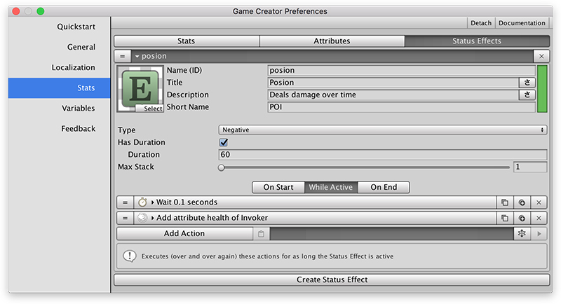
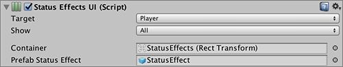
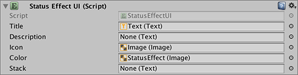

# Poison Status Effect

The **Stats** module comes with a great tools to create any kind of **Status Effect**. Here we'll learn how to create one of the most common ones: The **Poison**. 


It is important that before reading this section you know how to create a **Status Effect** and which options and properties it has.


Here are the key elements of this particular **Status Effect**.

* We want out **Poison** to slowly drain hit points from the player for as long as it's active.
*  We also want the **Status Effect** to wear off after some seconds.
* Last we also want to disable the player's locomotion system and display: "_You are dead_".

## Status Effect Definition

Open the _Preferences Window_ and head to the **Stats** section. Open the **Status Effects** tab and create one.

The most important part here are the **Has Duration** property, which is set to true and the amount of seconds the effect lasts.

The other important section are the **Actions**. The **Poison** effect doesn't have any **On Start** nor **On End** **Actions**. All the logic is inside the **While Active Actions**, which are a special **Actions** that is constantly executed while the effect is active. In this case we wait 0.1 seconds and right after that the health of the **Invoker** is reduced by a certain amount.

## Adding a Status Effect

To apply the **Status Effect** all that needs to be done is to use the **Status Effect** **Action**. This instruction allows to add and remove individual elements or by category.

In this case we want the _Green Ball_ to execute a **Status Effect Action** which will add the **Poison** effect to whatever object that collides with it.

## Displaying the Status Effect

To display the current **Status Effect** \(poison in this case, though should work for any other you create\) all that needs to be done is to create a container where all **Status Effects** will be displayed and create a prefab that will populate that container with each individual element.

The third scene in the _Stats Examples_ has a **Status Effects** object inside the **Canvas-Health** prefab. That object has a vertical layout group that dynamically organizes and aligns its child elements.

**Status Effects UI** component references a prefab called **Status Effect UI** which is used to display the information of the current status effect, such as the green skull and the title of the effect.

The **Status Effects UI** and **Status Effect UI** will automatically update their information when the status effects of the target change.

