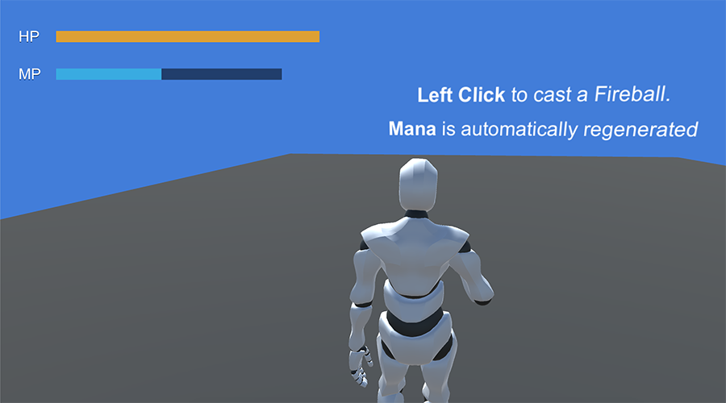
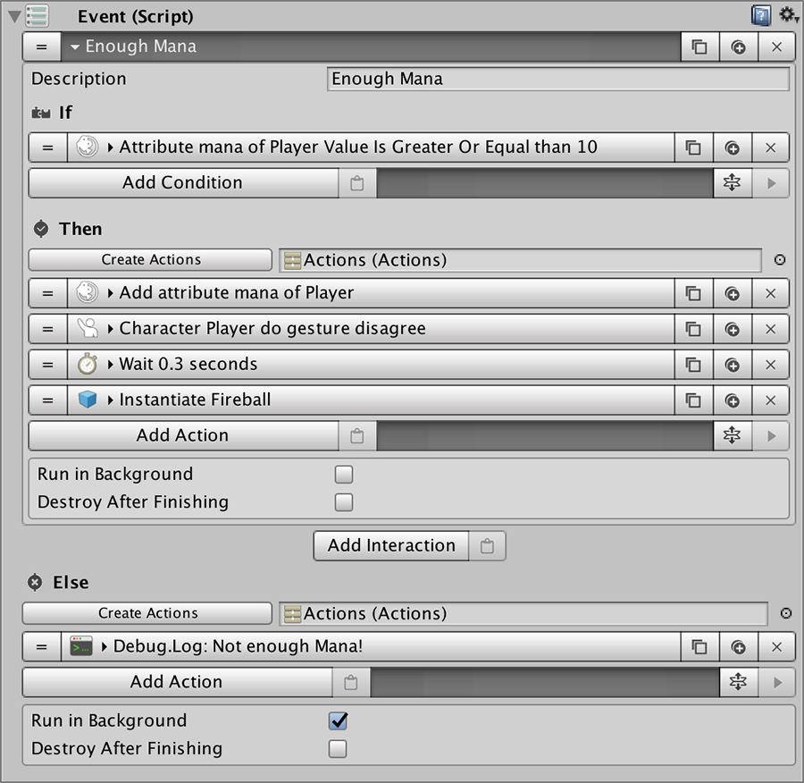

# Regenerative Mana

A lot of games feature some kind of regenerative gauge. It can either be health after a short delay of not receiving damage or a small but constant increase of the energy/mana points.

The **Stats** module's second example shows how you can implement regenerative mana as well as casting a spell only if there's enough points.

## Mana Regeneration

To regenerate **`mana`** over time is as easy as creating a **Trigger** that invokes an **Actions** object as soon as the game starts. These **Actions** are:

* **Increase** the Mana attribute by 5
* **Wait** 0.1 seconds
* **Restart** the Actions object

This sequence will ensure that every 0.1 seconds, the player's mana attribute will increase by a small portion.


You can also use the value of another **Stat** as the amount of **`mana`** recovered so that it takes into account possible **Status Effects** or the current level of the player.


## Fireball Spell

To cast the **Fireball** we first need to know if there is enough **`mana`** in the player's gauge. To do so, we simply use a **Trigger** that detects when the user has pressed the _Left Mouse_ button. As soon as that happens it invokes an **Event** which checks if there's enough mana to cast the spell.

Then, to actually cast the spell we use the **Instantiate** **Action**, which creates an instance of a prefab we have previously designated as the **Fireball**.


When casting a **Fireball** the player also plays a **Gesture** so the effect looks fancier.


