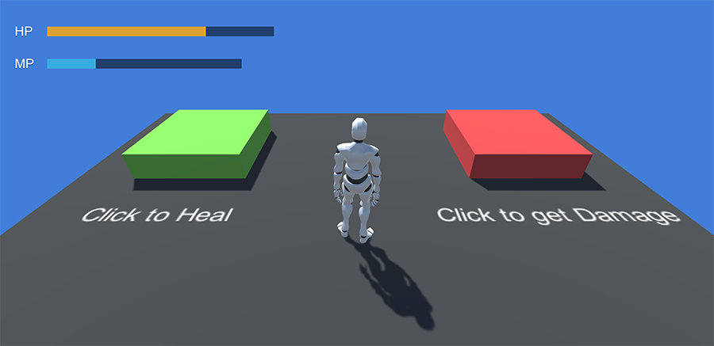

# Simple Health Bar

Health, Energy, Mana, Stamina, ... All these attributes are usually represented as a UI element. The Stats module provides a very simple way of showing those and define rules when they change.


This section assumes you have at least read once the rest of the **Stats** documentation and you know what's the difference between a **Stat** and an **Attribute**.



We recommend opening the **Stats Examples** while reading this documentation section. In particular a scene named **Example 1**.


## Health Attribute

Let's start from the beginning. In order to represent the health we need two create to elements:

* A **Stat** that defines the maximum amount of health
* An **Attribute** that holds the current amount of health

To do so, open the _Preferences Window_ and click on **Stats**. If you have the **Example 1** scene open, you'll see there are a bunch of stats. The one that defines the maximum amount of health is called **`vitality`**.

The **Attributes** tab also has a some elements. As its name implies, the **`health`** attribute is the one that handles the health gauge and has the **`vitality`** stat bound.

To represent the UI all we need to do is to create a _Canvas UI_ object and add the **Attribute UI** component. This component allows to display a information about an **Attribute** in different formats and automatically updates the information when the attribute changes.

The example that comes with the **Stats** module has a prefab called **Canvas-Health** which displays both the **`health`** and mana **`attributes`**.

## Damage & Heal

To **damage** and **heal** the player all we need to do is to use an **Action** called **Change Attribute**. This  instruction allows to _set_, _add_ and _multiply_ an attribute by a value \(which can be a constant value or a variable\).

In this case we've added a **Trigger** component set to be fired when the user left-clicks the red/green box and calls the **Action Change Attribute**. To heal we add +10 to the Player's **`health`** attribute and we add -10 when we want to damage.


An **Attribute** is always clamped between 0 and the **Stat** value, so subtracting -10 to an attribute which its current value is 2 won't be -8, but 0.


Pretty simple, right? Let's take a look at a more advanced example in the next section!

