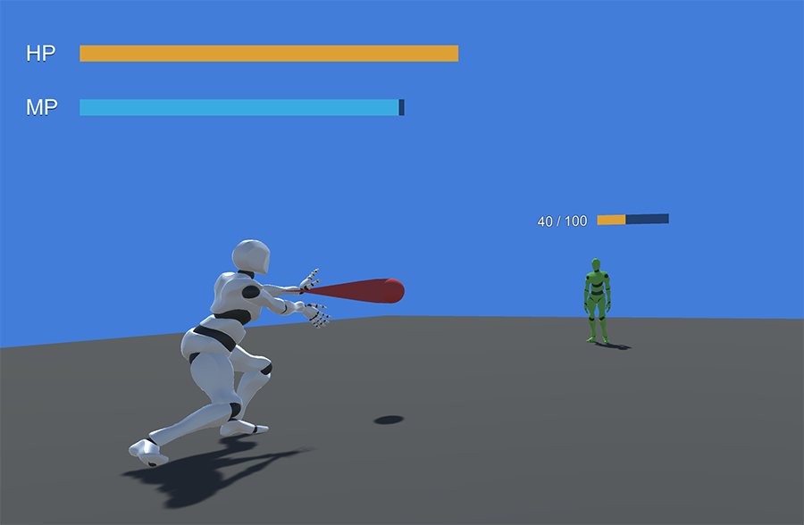
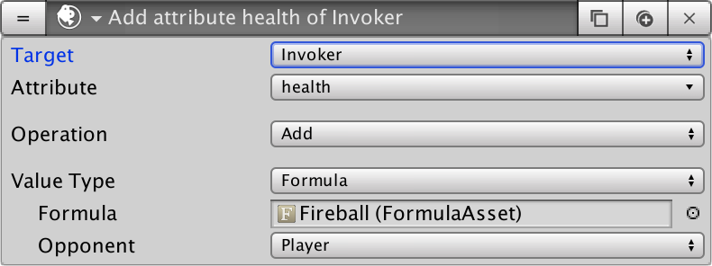

# Strength and Armor

Until now we've seen how we can output, check and modify Stats and Attributes that involve one single target. But what happens when we need to target more?



In this case we'll be covering how to deal damage to an enemy based on the attacker's power and the attack receiver's defense stats.

## Attack & Defense Stats

First and foremost we need to define a couple of **Stats** that will be shared across all characters: The **`Attack`** and the **`Defense`**.


For simplicity we haven't created a **Formula** for either the **`Attack`** or the **`Defense`** **Sats**. A **Stat** without a **Formula** will return its value as it is.


## The Fireball

To cast the **Fireball** spell we need to create a **Trigger** that listens for a certain key \(in our case the _Mouse 0_\) so that it starts an **Action** that will instantiate the **Fireball** object.

This **Fireball** object will have a **Trigger** that detects when it collides with _any_ game object. For every game object which it collides with, we'll invoke an **Action** sequence that will reduce the health stat of the collided object.


Note how we can try changing a **Stat** value of any object. If that object doesn't have a **Stats** component, it will simply ignore that **Action**.


## Damage Output

We've previously seen how we can increase the **`mana`** of a character by a fixed certain amount over the course of time. Now we want to do something similar \(change the value of an **Attribute**\) but by a dynamic value that depends both on the attacker's **`attack`** stat and the target's **`defense`** stat.



To do so, instead of using a constant float value we'll be using the output of a **Formula** as the value we'll be subtracting to the **`health`** attribute of the enemy. Here's how that Formula looks like:

```text
-1 * (stat:other[attack] - stat[defense])
```

Let's break that down: Because we're executing the **Action** from the enemy's point of view, **`stat:other[attack]`** returns the attack stat of the caster of the **Fireball**. We subtract to the attack power the defense of the enemy with **`stat[defense]`** and we finally multiply the whole expression by -1 because we don't want to increase, but decrease the **`health`** of the enemy.

