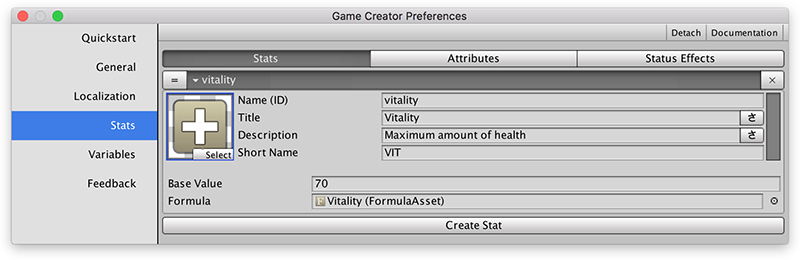
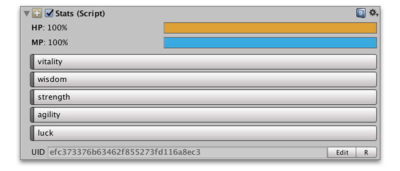

# Stats Overview

The **Stats** module is divided in two main sections:

* **Stats tab in Preferences Window:** Allows to define all the different stats, attributes and status effects and their initial default values.
* **The Stats component for Game Objects:** This is where the current values are stored for each game object's stat and attributes, as well as all of its status effects and stat modifiers.

The Stats _Preference Window_ has 3 distinct tabs that separate the 3 concepts that shape an entire progression system: **Stats**, **Attributes** and **Status Effects**.

## Stats

Stats are numeric values that represent a particular characteristic of a character or object. For example, how strong a character is or what is his maximum amount of health.

A stat has the following properties:

* **Unique Name \(ID\):** This is for internal use only and uniquely identifies that stat among the rest
* **Title:** The title or name of the Stat. This text can be localized
* **Description:** A small description of the Stat. This text can be localized
* **Short Name:** Some games prefer to show an acronym of the stat instead of the full name
* **Color:** The color that represents the Stat
* **Icon:** The icon that represents the Stat

These properties are common between **Stats**, **Attributes** and **Status Effects**. A Stat has also a _base_ \(or default\) value and a _Formula_ object field.

Because a **Stat** is something that dynamically changes during gameplay, the **Stat** value is the result of applying the _base value_ to a pre-defined _formula_.


**Formulas** are a very powerful objects that parse a mathematical expression and return the result. More information about Formulas in the [Formulas](formulas.md) section.


For example, a common case is where the **`Strength`** stat is the current strength base power. The formula in this case would be the returning the _base value_ of the **Stat**.

## Attributes

**Attributes** are very similar to **Stats** but their value ranges from 0 up to a maximum defined by a **Stat**. For example, the current health of a character is an attribute.

Apart from the common properties with a **Stat** \(title, description, short name, color and icon\) an **Attribute** also has a reference to another **Stat**, which defines the maximum value that **Attribute** will have during runtime and the percentage filled at the beginning.

For example, you can use the **`vitality`** stat as the maximum amount of **`health`** a character can have and have it filled only 50% at the beginning of the game.

## Status Effects

The **Status Effects** are, as their name implies, temporary effects that happen to a character or object that enhance or decrease one or more of it **Stats**.

A common example of a **Status Effect** is the **Poison**, which drains life from the affected character over time. Here's a breakdown of a Poison Status Effect:

* **Type:** There are Positive \(or Buffs\) status effects, Negative \(or Debuffs\) and Other.
* **Duration:** If a Status Effect has a duration, it wears off passed a certain amount of seconds.
* **Max Stack:** The amount of Status Effects of the same type a character can have active at a given time.

A **Status Effect** also has 3 Action objects that are executed at different life cycles.

* **On Start:** These Actions are called when a Status Effect is added to a object
* **While Active:** These Actions are _constantly_ executed while the Status Effect is active
* **On End:** These Actions are called right after the status effect is removed or wears off


Notice that the **While Active Actions** are executed again after finishing. It's a good idea to add a **Wait** action so it halts the execution for 0.1 seconds at least.


## Formulas

Formulas are one of the key components of the Stats module. They allow to execute mathematic expressions at runtime as well as using custom Game Creator symbols.

For example, the formula **`stat[strength] + dice(2,6) - 10`** returns the final value of the stat named strength plus a random value of 2 rolls of a dice of 6 faces minus 10.


The full list of all available symbols can be found in the **Formulas** section as well as in the built-in documentation of the **Formula** object in Unity \(so it is easier to write them\).


## The Stats Component

Once you have all your **Stats**, **Attributes** and **Status Effects** defined in the _Preferences Window_, you can add the **Stats** **component** to any game object.

The **Stats** **component** tracks the information of the scene instance. You can add a **Stats** component to any game object and even modify each **Stat's** default values per object.


During game play, the **Stats** component information changes and displays the current runtime values so it is easier to debug.


