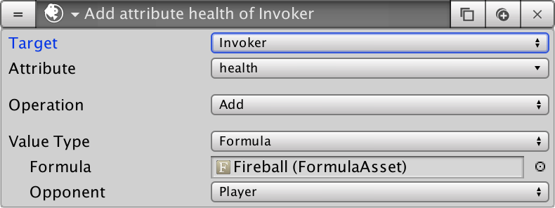

# Formulas

**Formulas** are one of the most powerful tools in the **Stats** module. They allow to easily define mathematic expressions that will affect the output of the different _Stats_, _Attributes_, damage outcome, ... Or practically anything involving numbers.


**Formulas** are a bit abstract and require some time and effort to wrap your head around them. If you feel lost we'd recommend you read the [Common Use Cases](../common-use-cases/), where we show how to use them, starting from the most basic form and progressively increasing the complexity for more advanced games.


## Introduction

Every RPG game has its own system. Some are based on the famous **D20** from _Dungeons and Dragons_ and other have their own proprietary system. In order to give you the flexibility to use whatever system you want we've come up with the **Formula** objects, which all they do is output a number.

**Formulas** can be used for a wide variety of things. For example:

* Define the value of a **Stat**
* Calculate the damage output of an attack
* Display new **Dialogue** options based on the output of a **Formula**


**Formulas** are not limited to the **Stats** module. They can be used with other modules such as for **Quest** tracking, displaying new **Dialogue** options or crafting objects with the **Inventory** module.


### Basics

Let's begin with the basics. A Formula object has a text field where you can type some words. Let's begin with something very simple:

```text
2 + 3
```

When we execute this formula, the output will always be 5. If we use this as the **Formula** for the **`strength`** stat, the player and all the enemies will always have a **`strength`** of 5 points.


You can use the symbols _add_ \(**+**\) _subtract_ \(**-**\) _multiply_ \(**\***\) and _divide_ \(**/**\). You can also group different operations using parenthesis to increase the priority of operands.


This **Formula** always returns a fixed value; Not very exciting, huh? Let's complicate things a bit.

Let's say we're creating a Formula that will define the value of our **`dexterity`** stat. In our game, the **`dexterity`** helps the player shoot with more accuracy. The base value \(initial value\) is 1 and is increased by 5 for each level. The Formula of the dexterity would then be:

```text
this[value] + (stat[level] * 5)
```

Let's break this down. **Formulas** have a set of pre-defined symbols that help you build your own mathematical expressions. One of them is the **`this[value]`** symbol, which basically means the base value of the **Stat**, in this case: 1

Another **Formula** symbol is the **`stat[NAME]`**. This allows you to access the final value of a stat identified by _NAME_ from the same object. In this case, we're accessing the level of the character and we multiply this value by 5.


See [Formula symbols](formulas.md#formula-symbols) section for a complete list of the available ones.


The result of the previous formula is that if the player is at level 1, its dexterity stat will be **`1 + (1 * 5) = 6`**, and if its at level 4 it will be **`1 + (4 * 5) = 21`**.

Still reading? Great! You have just learned the hardest part!

### Intermediate

Now that you know the basics of how a **Formula** works, let's dig a bit deeper. We previously saw how to calculate a character's stat using its own information. But we might also want to calculate a value taking into account two objects.

The most common scenario would be having a character attack an enemy. The damage of the attack could be the value of the **`strength`** stat of the player minus the **`armor`** stat of the enemy. 



In this case, the **Formula** would be:

```text
stat[strength] - stat:other[armor]
```

The **`stat[NAME]`** symbol refers to the invoker of the calculation. In this case, the player wants to know the amount of damage it outputs. The **`stat:other[NAME]`** refers to the opponent of the **Formula**.


Not all **Formulas** will provide a valid "**`other`**" reference. It only makes sense when the calculation of the **Formula** is executed having two targets \(the **`invoker`** and the **`other`**\)



All symbols follow a naming pattern. When accessing a property by name, use the square brackets:**`stat[strength]`**. When accessing a property of another object, specify the target after double dots:**`stat:other[strength]`**. When calling a function, use parenthesis for parameters: **`rand(1, 5)`**.



See the [Strength & Armor](../common-use-cases/strength-and-armor.md) use case for an example.


### Advanced

You might be wondering what the heck is the graph at the bottom of the Formula object.


  
With the current Formula system you already know how to output a value depending on different inputs. But these values are not discreet, meaning that increasing one a bit will affect others.

Though this is the desired effect most of the times, there are others where you only want to increase a value once it reaches a threshold. The most common example is a character's level.


**Example:** A character has an amount of **experience points**, but gaining one more doesn't immediately increase the **level**. There are threshold levels where a level is only increased once the **experience points** surpass a certain amount.

To make things more difficult, each time a level is gained, the amount of **experience points** to reach the next one increase.


That's why the **Progression Tables** com into play: You input a value \(called **Progress**\) and the table outputs a number \(aka **Tier**\). Notice that there can only be one per **Formula**.

**Progression Tables** have two parameters: **`Threshold`** and **`Max Tier`**. 

* **Threshold** is the amount increased by each new tier.
* **Max Tier** is the maximum value a **Progression Table** can output.


To make things easier, the **Threshold** is the extra amount of experience added that you'll need to reach the next level. The **Max Tier** is the maximum level your characters can reach.



You can click a bar of a **Progression Table** graph and see the amount needed so it returns that tier number.


We've put up an example of how to use a Progression Table to define the Level of a character based on the amount of experience points in the [Common Cases](../common-use-cases/levels-and-xp.md) section.

## Formula Symbols

| Symbol | Description |
| :--- | :--- |
| **`this[value]`** | The base value of the Formula |
| **`table[input]`** | The tier of the Progression Table |
| **`table:rise[input]`** | Returns the percentage complete to reach the next tier |
| **`rand[X, Y]`** | Returns a random value between X and Y |
| **`dice[R, S]`** | Returns the value of rolling R dices of S sides |
| **`chance[X]`** | Returns 1 if a random percentage is less or equal to X, and 0 otherwise |
| **`stat[name]`** | Returns the value of a stat identified by name |
| **`attr[name]`** | Returns the value of an attribute identified by name |
| **`stat:other[name]`** | Returns the value of the other stat identified by name |
| **`attr:other[name]`** | Returns the value of the other attribute identified by name |
| **`local[name]`** | Returns the value of a local variable \(number or bool\) identified by name |
| **`local:other[name]`** | Returns the value of the other local variable identified by name |
| **`global[name]`** | Returns the value of a global variable \(number or bool\) identified by name |
| **`min[X, Y]`** | Returns the smallest value |
| **`max[X, Y]`** | Returns the largest value |
| **`round[X]`** | Rounds the value to the nearest integer |
| **`floor[X]`** | Returns the largest integer smaller or equal to X |
| **`ceil[X]`** | Returns the smallest integer greater or equal to X |

