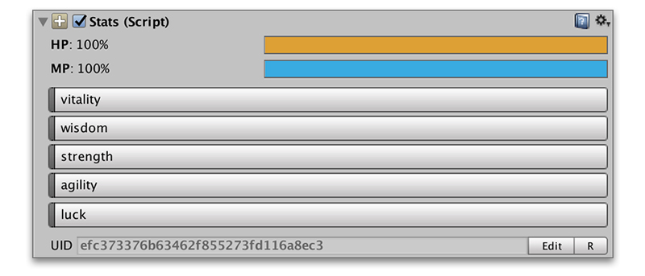
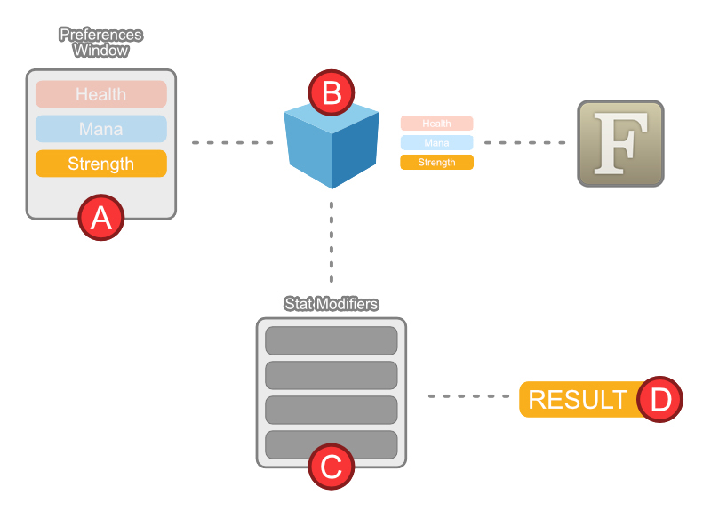

# Stat

A **Stat** is a numeric value that represents a particular characteristic of a character or object. For example, how strong a character is or what is his maximum amount of health.

Stats are defined in the _Preferences Window_ and then used in the **Stats** component on any Game Object.

## In Preferences Window

You define the name, icon, color and different visual properties of a Stat. You also define the default value it will have \(**`base value`**\) and the Formula that will calculate its final value.

## In Stats Component

The **Stats** component is a container for all **Stats** and **Attributes** a character or object has, plus any **Status Effects** and **Stat Modifiers**.


You can modify the default **values** and/or **Formula** assets in the Stats component


## Stats in Runtime

The Stats module has a set of **Actions**, **Conditions** and **Triggers** that allow you to retrieve the value of a **Stat**. Its value is the result of applying an fixed number of steps:

Let's take for example, the player wants to hit tree. In order to calculate the damage the tree takes, we need to calculate the player's **`strength`** stat:

* **\(A\)** The default value of the stat **`strength`** and the formula are retrieved from the _Preferences Window_.
* **\(B\)** The **Stats** component might have overwritten the default value and/or the **Formula** object for that particular **Stat**. If so, those are the values that will be used. The **Formula** expression is then evaluated with the **value** as input.
* **\(C\)** The result of evaluating the **Formula** is then given as the input of the rest of _Stat Modifiers_ \(which might be from **Status Effects** or because the character is wearing a certain weapon\), which will increase/decrease the value accordingly.
* **\(D\)** The result is the final value of the **`strength`** stat.


There's a clear distinction between the base value of a **Stat** and its final result



These concepts are better off explained with examples. We've gathered a bunch of [common case scenarios](../common-use-cases/) where we believe this might be easier to understand.


## Actions

There are some **Actions** that let you interact and query stats values and states.

* **Change Stat:** Allows you to change the base value of a stat. The value can come from a variable of be a constant value
* **Sync Stat to Variable:** Assigns the current value of a Stat to a specific global or local variable.
* **Debug Stat:** Prints the value of a Stat in the console

## Conditions

Same as Actions, Conditions with stats allow to use the Stats features outside of the module, such as in the Inventory, Dialogue modules or even your own custom systems

* **Stat Value:** Returns the final value of a Stat and compares it to another constant or variable number.

