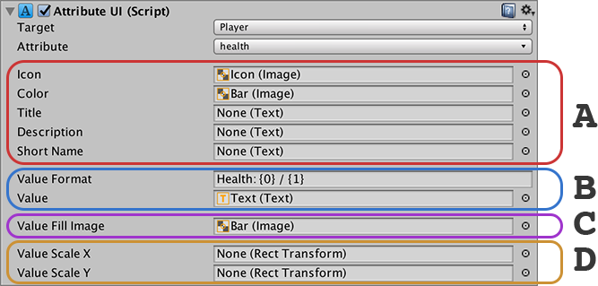

# Stats UI

What good is a **Stat** or **Attribute** if you don't display it? The **Stats** component comes back with a collection of components that makes this process a breeze.

There are 4 components in total:

* **Stat UI:** Displays current information of a **Stat** in different formats.
* **Attribute UI:** Displays current information of an **Attribute** in different formats.
* **Status Effects UI:** Shows information about all **Status Effects** of a target.
* **Status Effect UI:** Shows information about a single **Status Effect** of a target.


**Status Effects UI** and **Status Effect UI** are very closely related and are usually used together.


## Stat UI & Attribute UI

TODO

