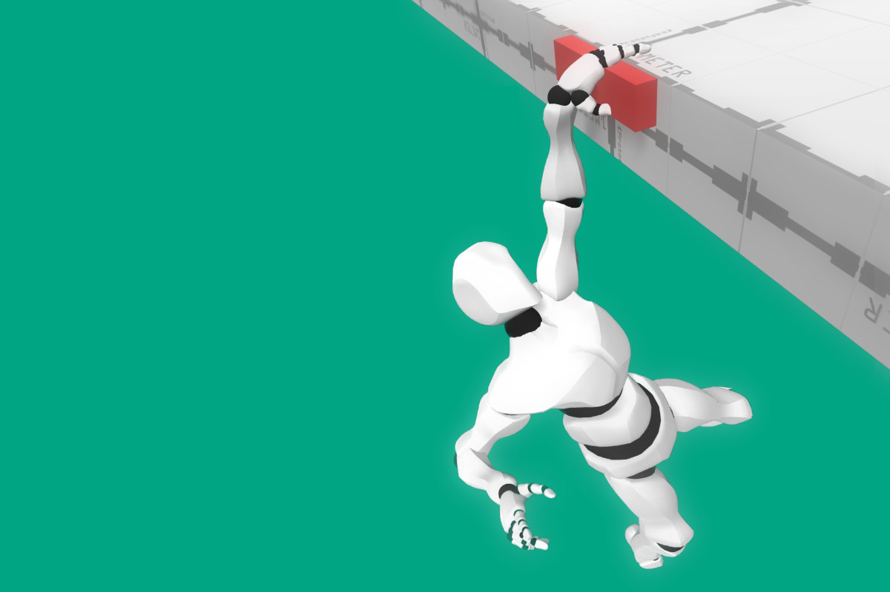

# Traversal

The **Traversal** module is a module for **Game Creator** that empowers characters with features that allow them to smoothly traverse the environment. Some movements include parkour jumps, vaulting over obstacles and hanging from ledges.


Download the [**Traversal**](https://gamecreator.page.link/traversal) module


## Overview

The **Traversal** module is mainly composed of two components: The **Obstacle** component and the **Climbable** component. Each of these components is linked with an homonymous **Obstacle Clip** asset or **Climbable Clip** asset that defines its behavior.

* **Obstacles:** Simple obstacles that the player or character activates in order to overcome them. These do not require any input from the player in order to be traversed once activated. Some examples are: _Vault_, _Wall-Runs_, _Grappling Hook_, _Jumps_.
* **Climbable:** More complex obstacles that require the player's input in order to decide how and where to traverse them. Some examples are: _Climbing ledges_, _Walking on a balance plank_ and _climbing a ladder_.

Learn more about how Obstacles and Climbable elements are configured by following the links below:





You can easily create any type of traversal ability you can think of with these two components. To give you a head start, the **Traversal** module with _built-in_ abilities you can use right from the beginning:

* **Balance Plank:** An horizontal plank where characters can only move forward or backward.
* **Cover/Shimmy:** A high and a low cover obstacle where characters can put their back against in order to slowly move tracing their perimeter.
* **Grapple Hook:** A special mechanic that allows a character to move from its current position to the grapple's hook position by throwing and reeling a rope.
* **Hold onto Ledges:** There are 2 different types of ledges a character can hang onto in order to climb a wall. Each type of ledge comes with a braced and a hanging variation.
* **Jump:** A simple mechanic that allows a character to jump from its position to a fixed jump destination.
* **Ladder:** A vertical ladder that characters can hold onto and move up and down.
* **Mantle:** An horizontal object that allows characters to climb over small obstacles, such as small steps or levels.
* **Vault:** An horizontal obstacle that characters can jump across and vault over it.
* **Wall-Run:** An obstacles where characters can run across and reach the end, similar to Prince of Persia, Titanfall or Star Wars: Fallen Order.
* **Zip-Line:** A free-flow obstacle that allows characters to grab onto and zip down or up to the other end of the zip-line.

To know more about the built-in elements, follow the link below:




The built-in abilities that come with the **Traversal** module can be modified as much as you want. You can duplicate them and create your own abilities or start from scratch.


