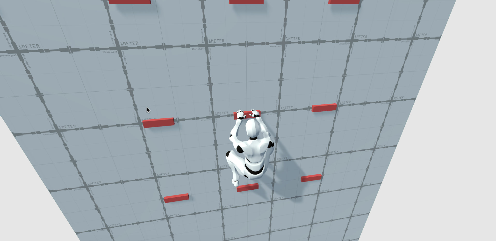
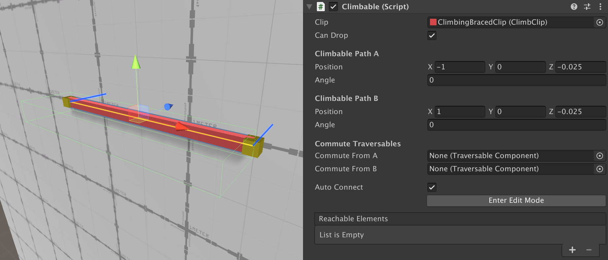
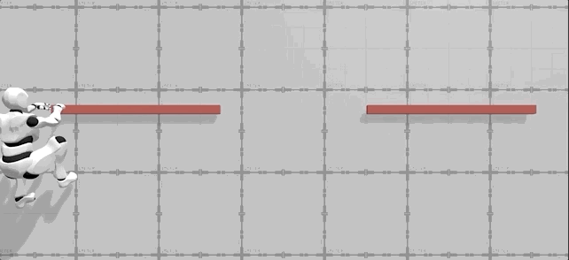
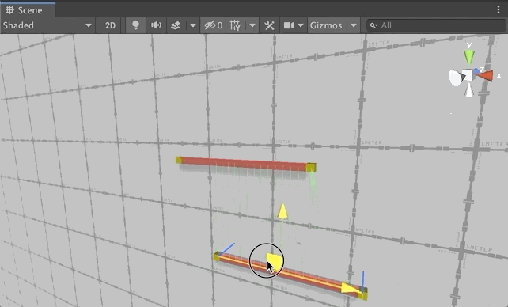
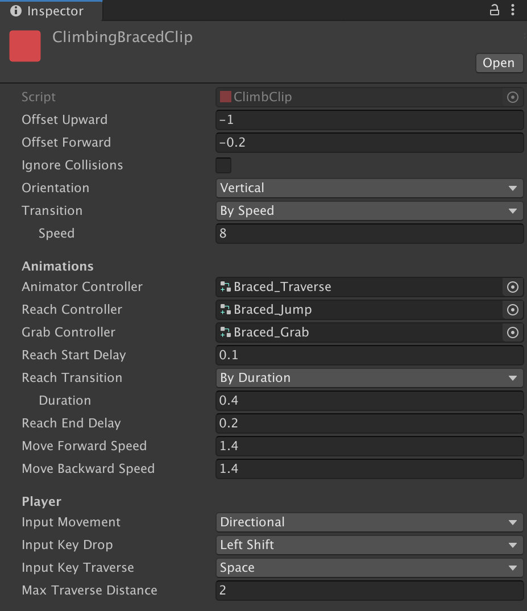

# Climbables

**Climbable** elements are much more complex than _Obstacles_ as they allow _Characters_ to decide how to traverse them, either via input or automatically.

Similar to _Obstacles_, **Climbable** elements are composed of a **Climbable component** that references a **Climbable Clip**, which determines how the _Character_ will traverse this particular **Climbable** element.

## Climbable Component

**Climbable components** define the boundaries of a segment in _Local Space_ from which a _Character_ can move along, but not any further.

The **Clip** field is a reference to a **Climbable Clip**, which contains all the necessary information for the _Character_ to traverse this Climbable element. For more information about **Climbable Clips**, see the section below.

The **Can Drop** field determines whether a _Character_ can let go from this climbable object or not. This is very useful in some cases, where you don't want the player to be able to exit the climbable, such as while being on a Balance plank.

The **Climbable Path A** and **Climbable Path B** are two points in _Local Space_ that determine a segment from where a _Character_ can freely move.


In the _Scene View_, this segment is represented with a yellow thick line and two yellow cubes at each end.


Also, each point A and B has an **Angle** field, which represents the direction in which a _Character_ will look at while traversing this climbable element.


If **Angle A** and **Angle B** are different, the _Character_ will smoothly interpolate between them when moving along the path. This makes it perfect in case the path is not aligned with the world axis or the Character should turn corners.


**Commute From A** and **Commute From B** fields are optional ones that make it possible to commute to another _Climbable_ or _Obstacle_ when reaching the edge of the _Climbable_.


For example, you may want to make the _Character_ automatically play the "Mantle Ledge" _Obstacle_ when a _Character_ reaches the top end of a Ladder.


The **Reachables** field is similar to the **Commute From** fields, but unlike them, these require from the player's input and have a finite jump distance.

Before going any further, let's see how **Reachables** work with an example: Imagine there's a Character holding onto a Ledge Braced climbable. Upon reaching the right corner, the Character will require the player's input and a directional direction to jump to the next ledge, if any.


**Reachables** are **Obstacles** and **Climbable** elements around a **Climbable element** that a _Character_ is allowed to jump to. It's up to the game designer to define which **Climbable** elements can reach other elements.


However, placing each **Reachable** in the **Reachables** array field can be tedious and a slow process. So in order to make life easier for game designers, the **Traversal module** automatically detects **Reachable** elements around them and fills the array with them any time the **Climbable** element is modified in the Scene View.


It may be a bit difficult to see due to image compression, but the **green lines** that connect the two **Climbable** elements indicate possible jumping/reaching points between them.


There may be some cases in which you don't want **Climbable** elements to refill their **Reachables** array. For those cases one can disable the **Auto-Connect** field.


To make it even easier, the **Climbable** **component** contains an "**Enter Edit Mode**" that will allow to independently modify each path point using Scene View handle gizmos.



It is important to note that if a **Climbable** element has another **Obstacle** or **Climbable** element set as **Commutable**, this object will not be added to the **Reachable** list.



**WARNING!** When moving a Climbable element \(A\) to gather nearby reachable elements the connection is only done from the current Climbable element \(A\) towards the nearby ones \(B\). You'll need to either manually connect or move those nearby Climbable elements \(B\) to make the connection bi-directional.


## Climbable Clip

Similar to _Obstacle Clips_, **Climbable Clips** allow to define how a _Character_ will traverse a **Climbable** element and reuse this logic on other elements.

The **Climbable Clip** is split in three big sections: **General** parameters, **Animations** and **Player**.

### General Parameters

General parameters are very similar to the ones found in the Obstacle Clip. **Offset Upward** and **Offset Forward** allow to define an offset in local space relative to the _Character_ from where the "grab" will be originated.

By default the origin of the handles are at the root of the _Character_ \(usually at the bottom-most position of the _Character_, between their feet\). However, some _Climbable_ elements look better if the _Character_ aligns itself.


For example, the **Ladder Climbable Clip** uses a value of **-0.2** on the **Offset Forward** field in order for the Character to not be inside the ladder, but slightly outwards.

On the other hand, the **Ledge Climbable Clip** moves the **Offset Upward -1** units, as a standard character usually has a height of 2, so the ledge aligns around the chest of the Character.


The **Ignore Collisions** field allows _Characters_ to ignore any collisions when traversing the current **Climbable** element.


Contrary to **Obstacles**, it is recommended that **Climbables** do not ignore collisions, as characters shooting at them will always miss.


The **Orientation** field defines whether the _Climbable_ element is vertical or horizontal. This field has a direction impact on how a _Character_ will detect other reachable elements. 

* If the Climbable element is set to **Vertical**, the forward and backward input will search for climbable elements that are in the XY plane \(above or below\).
* If the Climbable element is set to **Horizontal**, forward and backward input will look for other reachable elements on the XZ plane \(in front or back\)

The **Transition** field defines how much will it take for a Character to completely engage with the Climbable element. 

It can either be by a certain **Duration** or by **Speed**, depending on the distance to the Climbable element and the Character.

### Animation Parameters

A **Climbable Clip** requires 3 Animator Controllers in order to work. Each of these should be an _Animator Override Controller_ that implement either the **Traversal** or the **Reachable** _Animator Controllers_.


Changing _Runtime Animator Controllers_ is a very advanced feature and it should only be done if one plans to create custom animations or custom Climbable elements.



Similar to Obstacle Clips, animations on **Climbable Clips** stretch their duration in order to better suit the pacing of reaching from one climbable element to another. 


The **Animator Controller** field references a _Runtime Animator Controller_ that has a very specific structure. This controller defines the locomotion animations and how the character moves along the Climbable element.

The **Grab Controller** references a _Runtime Animator Controller_ that controls which animation should be played when a Character first grabs the Climbable element.

The **Reach Controller** references a _Runtime Animator Controller_ that controls which animation should be played when a Character jumps/reaches from the current Climbable onto another one.

The **Reach Start Delay** field determines, in seconds how much should the Character wait before moving from the current Climbable element to the next one, when reaching to another object.


Characters usually build energy before jumping, so typically all Climbable elements will have a delay between 0.1 and 0.5 seconds.


**Reach Transition** allows to control how long will it take for a Character to jump/reach from the current _Climbable_ element to the next one. It can either be using a fixed **Duration** or by **Speed**.

Similar to the _Reach Start Delay_, the **Reach End Delay** field allows to define how many seconds the character will be unresponsive after reaching for a new Climbable element.

Move Forward Speed and Move Backward Speed fields define the speed at which a Character can move along the Climbable element. The units of this field are Unity units per second.


Moving forward and moving backward will usually share the same value. However, in some cases, you'll want to have different values. For example, the **Ladder Climbable** element allows to move much faster downwards, because the Character slides through the Ladder, while moving upwards means performing an exerting task.


### Player Parameters

These parameters define how a Character interacts with the Climbable element. The **Input Movement** field defines how the character knows when to move forward or backwards. The default value is **Directional**, which are the WASD keys on a keyboard or the left joystick on controllers.


Because the Player is the only character affected by input controls, NPC character could not typically use Climbable elements, since there's no way for them to know how to traverse them.

However, an NPC can traverse a Climbable element if the Climbable Clip's **Input Movement** is set to "**Automatic Forward**" or "**Automatic Backwards**".


The **Input Key Drop** field allows to define a key that, upon being pressed, the Character will let go of the current Climbable element, unless the Climbable component has the "_Can Drop_" field unchecked. This button is typically associated with the Cancel button.

The **Input Key Traverse** field defines which key will be used to reach for other Climbable or Obstacle elements. This button is typically associated with the Space or Jump button.

The **Max Traverse Distance** field defines how far a Character can jump in order to reach other elements.

This value can be visualized when selecting a **Climbable** element with **Reachable** elements associated with it. The **green lines** that are drawn have a length between 0 and the **Max Traverse Distance**, so it's easy to determine whether a Character can reach another element or not.

