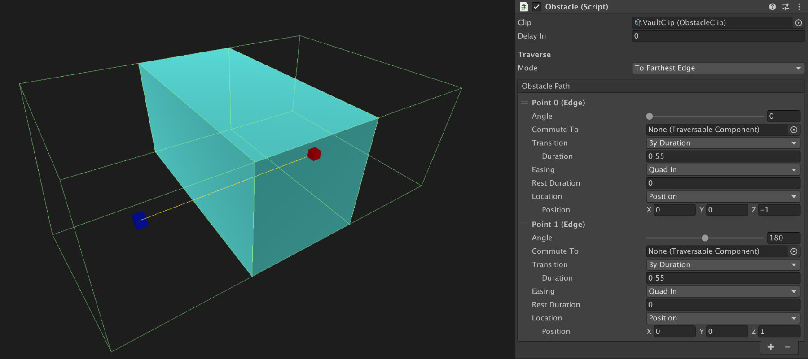

# Obstacles

**Obstacle** elements the simplest elements in the **Traversal** module. These allow characters to  overcome obstacles by playing an animation and finalizing without the need of the player's input.

It all begins with a **Game Object** that has an **Obstacle** component. This component defines the bounds of the obstacle, the path a character will take to overcome it as well as a reference to an **Obstacle Clip**, which will define how it is traversed and using which animations.

## Obstacle Component

The Obstacle component has two distinct sections: The parameters and the Obstacle Path section.

### Parameters

The **Clip** field is one of the most important. An **Obstacle Clip** defines how the **Obstacle** will be traversed, including the animations, exit speed and multiple tweakable values.


An **Obstacle** requires an **Obstacle Clip** in order to work and won't function properly if the reference is missing.



**Obstacle Clips** are meant to be reused in multiple places. 

For example, your game might have thousands of _Vaultable_ obstacles in a single level, at different positions, rotations and sizes. However, you can reuse the same **Obstacle Clip** for all of them. 

That's why there's a distinction between **Obstacles**, which define the available paths to overcome them, and **Obstacle Clips**, which define how it will be traversed.


The **Delay In** field defines how much time, in seconds will the character take to start moving along the path of the **Obstacle**. 


The **Delay In** field is most commonly set to zero in order to avoid breaking the flow of the movement. However, some parkour movements require to build momentum before releasing it. For example, jumping requires a few milliseconds to charge enough energy before releasing it through the legs towards the floor in order to push oneself


The **Traverse Mode** defines how the character will move along the path and is tightly coupled with the Obstacle Path section, which is explained further below. There are multiple options:

* **To First Point:** The Character will move from its current position towards the first point defined in the path.
* **To Last Point:** The Character will move from its current position towards the last point defined in the path.
* **To Closest Edge:** The Character will move from its current position towards the first or the last point defined in the path \(whichever is closer to the character\).
* **To Farthest Edge:** The Character will move from its current position towards the first or last point defined in the path \(whichever is further away from the character\).
* **From First To Last Point:** The Character will move from its current position towards the first position in the path and will follow the points path forward until it reaches the end point.
* **From Last To First Point:** The Character will move from its current position towards the last position in the path and will follow the points path backwards until it reaches the first point.
* **From Closest To Farthest:** The Character will move following the path defined \(either forward or backwards\) depending on whether the first point is closer or farther that the last point.
* **From Farthest To Closest:** The Character will move following the path defined \(either forward or backwards\) depending on whether the first point is further away or closer that the last point.


This might seem complicated, but once you understand how these work, it comes very naturally to pick the correct traverse mode option. To make it easier for you, we'll provide below some examples of obstacles and the **Traverse Mode** used:

**To First Point** and **To Last Point** are meant to be used for one-directional _Obstacles_. For example, dropping off of a ledge could use the **To Last Point** in order for the character to move from its current position to the ground, without any possibility of traversing the path backwards.

**To Closest Edge** and **To Farthest Edge** are meant to be used with two-directional _Obstacles_. This is the most commonly used traverse mode. For example, when a _Character_ wants to _Vault_ over an obstacle, it uses the **To Farthest Edge** because the target will always the be the point that is further away.

**From First To Last Point** and **From Last to First Point** are used when the _Character_ is required to follow the entire path, without skipping any point. A common case is when you want the character to jump, kick a wall mid-air to propulsate themselves even higher in order to reach a ledge.

**From Closest To Farthest** and **From Farthest to Closest** work exactly the same as **From First To Last Point** and **From Last To First Point**, but instead of always executing a fixed path's direction, they choose to play it forward or backwards depending on which point \(first or last\) is closer to the _Character_.


### Obstacle Path

The **Obstacle Path** is a collection of points that represent the path the character will follow to overcome the obstacle. How these points are traversed is defined by the **Traverse Mode** field \(see section from above\).


The **Obstacle Path** typically has 1 or at most 2 points. However, the **Traversal** module gives you the option to create as many path points as you want.


A **Path Point** has a set of values that represent how the character will interact with each of these points when traversing the Obstacle.

The **Angle** is a value that ranges from 0 to 360 and indicates the local rotation the character should look at when reaching this point.


For example, the **Vault** has an **Angle** value of 0 for the first point and 180 for the last one. That's because you'll want the character to look outwards after traversing an obstacle.


The **Commute To** field allows an _Obstacle_ to link the _Character_ with another _Obstacle_ or _Climbable_ object after traversing the current one.


The **Commute To** field is a very useful one. It is specially designed to link _Obstacles_ and _Climbable_ elements alike. You can, for example, grab a ledge after the character finishes running a wall. 

All that needs to be done is to drag the desired _Obstacle_ or _Climbable_ onto the Commute To field.


The **Transition** field allows to choose between transitioning to this point by either a fixed amount of time or by velocity.

By **Time** is useful for small obstacles and you prefer to keep the animation's length always the same, regardless of the distance between the Character and its destination. For example, vaulting uses a Time transition.

By **Speed** is usually used when the obstacle is larger and will take more than a few seconds to complete. For example, it's not the same traversing a _Zip-Line_ that it's end points have a distance of 5 units than 100 units. Choosing by **Speed** allows the _Character_ to traverse the obstacle at a constant speed.

The **Easing** field allows to slightly modify the pacing of the traversal. By default, traversing between points will use a constant **Linear** speed. However, some animations might look more polished using some kind of easing. For example, the built-in _Zip Line Obstacle_ uses a **Quad-In Easing** option, which makes the _Character_ feel like it grabs the line at starts gaining speed the further down it goes.

Th **Rest Duration** allows to stop the character's movement for a time before transitioning to the next point or ending the traversal. This is specially useful for obstacles like the Jump, where the character has a few milliseconds that represent the landing animation.

The **Location** field is another one that's very important. It represents the position of the point. It's calculated in _Local Space_ respect of the _Obstacle_ component's game object.


The **Location** can either be a **Point** \(Vector3\) position or a **Transform** reference.


## Obstacle Clip

The **Obstacle** component defines **where** the _Character_ moves to, the **Obstacle Clip** defines **how** they do it.

**Rotation Mode** and **Rotation Duration** allows to define how the character will treat rotation when traversing the _Obstacle_. By default, all _Obstacles_ will be set to **Towards Destination**. However, there might be some cases where you don't want characters to rotate at all.

The **Ignore Collisions** field allows the character to ignore any collisions with its _Character Controller_ component.


This may seem counter-intuitive, but most obstacles need to ignore any collisions while they are being traversed. Otherwise the character might get stuck.


The **Animation** field allows to define whether the _Character_ will play an animation from an **Animation Clip** or use a **Character State**. Obstacles tend to use simple **Animation Clips**, although some more advanced ones, such as the _Wall-Run_ or the _Zip-Line_, use **Character States** to adapt to the duration of the obstacle traversed.


**IMPORTANT NOTE ON ANIMATIONS:** It is very important to understand that **Animation Clips** played while traversing an obstacle will stretch to fit the length of the traversing.

This is very useful because vaulting over a small obstacle that takes, for example, 0.2 seconds, or vaulting over a bigger one that takes 0.8 seconds, will look exactly the same, as the animation will be stretched to last 0.2 seconds in the first case and 0.8 seconds on the latter.

**Animations** adapt to the **Obstacle**'s duration and not vice-versa.


The **Handles Offset Forward** and **Upward** define the point, in self local space, from which this particular obstacle the handle will be.

By default, the handles are located at the root of the object \(bottom of a character\). However, some obstacles might require the handles to be located around the center of the body or even up around the head. This is where you can define an offset for the handles.


This field isn't particularly useful for **Obstacles**. However, **Climbable Clips** do have the same exact field and its prevalence is much more in those. We'll explain more in detail how _Handle Offsets_ work in the **Climbable Clip** section.


The **Obstacle Clip** also allows to slightly tweak the movement applied using 3 animation curves: **Curve Offset X**, **Y** and **Z**. These curves are applied in local space, relative to the character \(being the Z axis forward\).


Curves are particularly useful when a character needs to trace a curved trajectory instead of following a straight path. F

or example, When a character performs an horizontal _Wall-Run_, it slightly moves upward to then slowly lose momentum and go down. This effect can be achieved modifying the **Curve Offset Y** so it starts at 0, builds up to a certain value around half way and then goes down back to 0.


To make the whole traversal feel as smooth as possible, each **Obstacle Clip** has a cross-fade value that determines how long, in seconds, will it take to go from the current _Character_'s animation to the one used as part of the **Climbable Clip**.

These fields are **Transition In** and **Transition Out**. We recommend using values between 0.1 and 0.5 seconds. Lower values will break the transition and higher ones might look too smooth and make the Character appear like it's floating.

Because not all obstacles allow to keep the momentum of the action, the last field is Exit Speed. This allows to define how the character will behave after exiting the current Obstacle phase.


For example, vaulting over an obstacle allows a character to continue moving without stopping. Thus, its **Exit Speed** option is **Walk Speed** or **Run Speed**.

However, making a superhuman jump will usually end up in a super-hero landing pose, discharging all momentum onto the floor and making it impossible for the character to move for a few milliseconds. The **Exit Speed** in that case is **None**.


